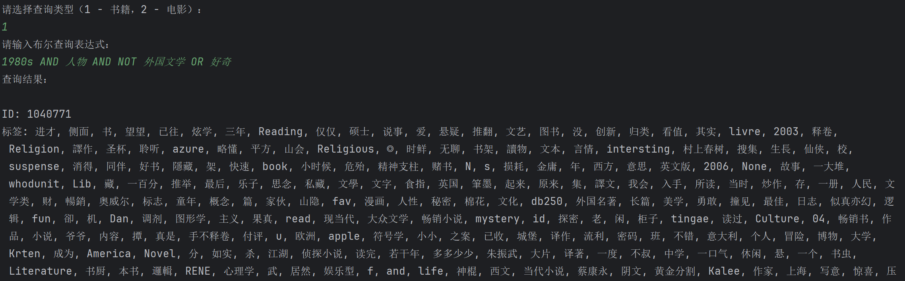
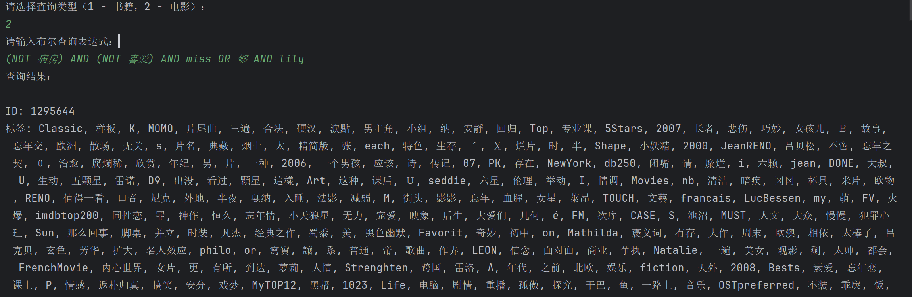
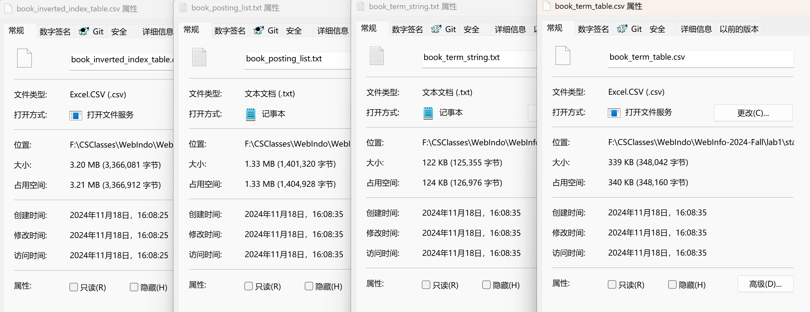
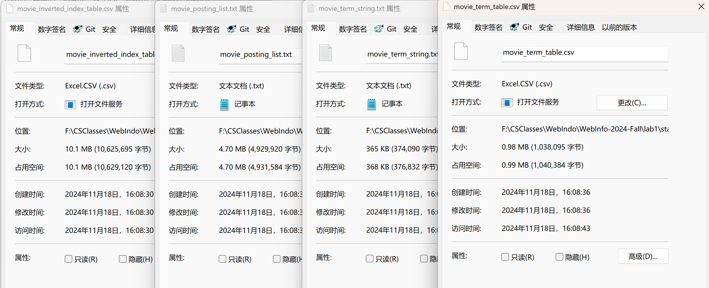
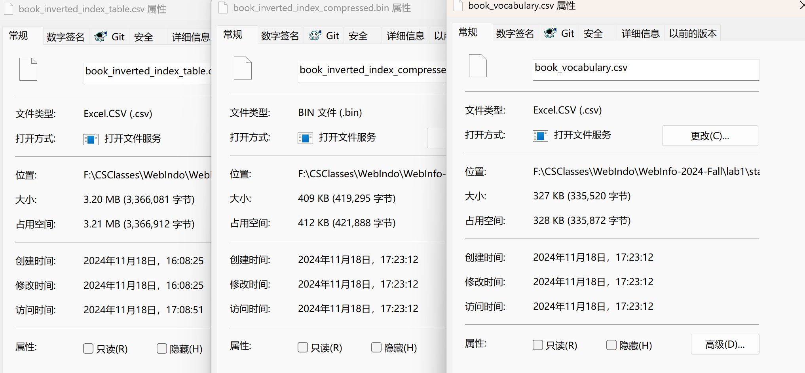
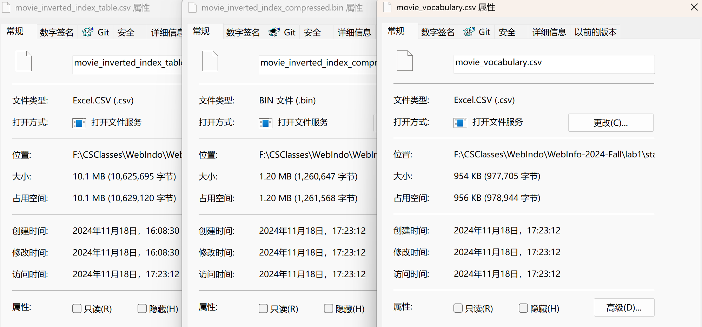
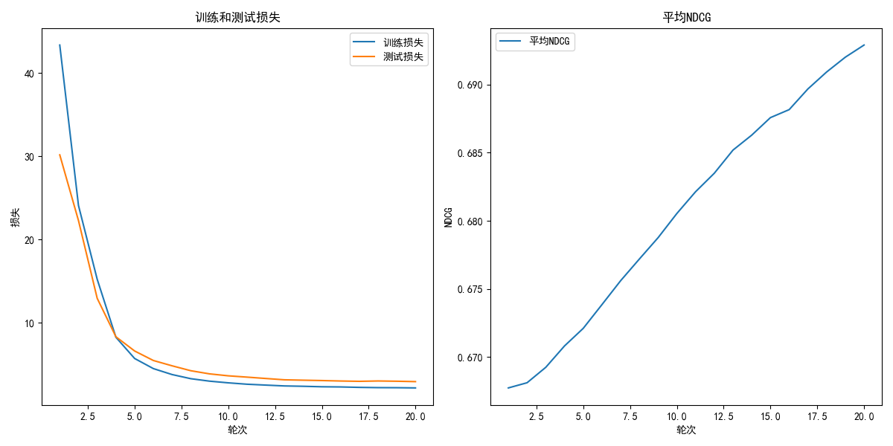
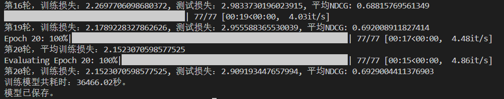
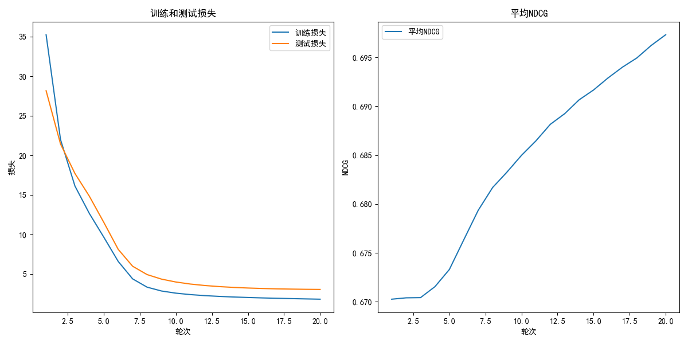
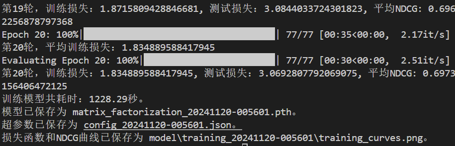

# Web信息处理与应用 Lab1

PB22081571薄震宇	PB22111613王翔辉	PB22020514郭东昊

[TOC]

## 实验要求

**stage1**：根据给定的豆瓣 Movie&Book 的 tag 信息，实现电影和书籍的检索。对于给定的查询，通过分词、构建索引、索引优化等流程，实现面向给定查询条件的精确索引。

**stage2**：基于豆瓣 Movie&Book 的 tag 信息、以及提供的豆瓣电影与书籍的评分记录以及用户间的社交关系，判断用户的偏好，对用户交互过的 item（电影、书籍）进行（基于得分预测的）排序。

## 文件组织

目录结构及文件含义如下

```
├── data/			// 本次实验提供的数据文件
├── figs/			// 图片文件
├── stage1/			// 第一阶段
│   ├── data/		// 第一阶段生成的数据文件
│   ├── doc			// 第一阶段的相关文档
│   ├── notebook
│   ├── bool_search.py	// 实现布尔查询
│   ├── bool_search_on_one_string.py  	// 实现将词项看作单一字符串压缩对应的布尔查询
│   ├── bool_search_with_skip_list.py	// 实现使用跳表指针的布尔查询
│   ├── dictionary_as_a_string.py		// 实现将词项看作单一字符串的压缩及查询一个词项的倒排列表
│   ├── extract_id.py					// 提取所有文档ID
│   ├── gen_inverted_index_table.py		// 生成倒排索引表
│   ├── split.py						// 实现分词等预处理操作
│   ├── var_len_bool_search.py			// 实现间距代替ID+可变长度编码压缩对应的布尔查询
│   ├── var_len_compress.py				// 实现间距代替ID+可变长度编码压缩方式的索引压缩
│   └── var_len_search_one_word.py		// 实现间距代替ID+可变长度编码压缩的查询一个词项的倒排列表
├── stage2/			// 第二阶段
│   ├── data/
│   ├── doc/
│   ├── graph_rec_model.py
│   ├── graphrec.ipynb
│   ├── test.py
│   ├── text_embedding.ipynb
│   └── utils.py
└── report.md		// 实验报告
```


## 实验过程

### stage1

#### 数据预处理

##### 选择分词工具

我们选择使用现有的分词工具：`jieba`（结巴分词）和`pkuseg`。

“结巴” 分词是GitHub 最受欢迎的分词工具，支持多种分词模式，支持精确模式，全模式，搜索引擎模式，支持自定义词典。

`pkuseg` 是北大语言计算与机器学习研究组开源的一款分词工具，它的特点是支持多领域分词，目前支持新闻领域，网络领域，医药领域，旅游领域，以及混合领域的分词预训练模型，用户可以自由地选择不同的模型。相比通用分词工具，它的分词准确率更高 。

使用时直接`import jieba`和`import pkuseg`即可。通过下面的代码实现分词工具的选择：

```python
# 选择分词工具
tool_choice = input("请选择分词工具（输入 'jieba' 或 'pkuseg'）：")
if tool_choice.lower() == 'jieba':
    use_jieba = True
    print("使用 Jieba 分词")
elif tool_choice.lower() == 'pkuseg':
    use_jieba = False
    print("使用 PKUSeg 分词")
else:
    print("输入有误，默认使用 Jieba 分词")
    use_jieba = True
```

- 通过命令行输入，用户可选择使用 `jieba` 或 `pkuseg` 进行分词。
- 默认情况下，若输入有误，则使用 `jieba` 分词。

##### 加载停用词表

```python
# 加载停用词表
stopwords_file = 'cn_stopwords.txt'
stopwords = set()
with open(stopwords_file, 'r', encoding='utf-8') as f:
    for line in f:
        word = line.strip()
        if word:
            stopwords.add(word)
```

- 从文件 `cn_stopwords.txt` 中读取停用词。
- 使用 `set` 存储停用词，便于快速查找。

**停用词过滤的实现**

- 在分词后的结果中，遍历每个词，检查其是否在 `stopwords` 集合中。
- 如果在停用词列表中，则过滤掉，不纳入后续处理。

##### 加载同义词词典

```python
# 加载同义词词典
synonyms_file = 'syno_from_baidu_hanyu.txt'
synonym_dict = {}
with open(synonyms_file, 'r', encoding='utf-8') as f:
    for line in f:
        words = line.strip().split()
        if words:
            representative = words[0]
            for word in words:
                synonym_dict[word] = representative
```

- 读取 `syno_from_baidu_hanyu.txt` 文件，每行包含一组同义词，使用空格分隔。
- 将同义词组中的所有词映射到代表词（该组的第一个词），构建 `synonym_dict` 字典。

**同义词替换的实现**

- 在词语经过停用词过滤后，检查是否在 `synonym_dict` 中。
- 如果存在同义词映射，则将词替换为对应的代表词。

##### 定义文件列表并初始化分词器

```python
# 定义文件列表
file_list = [
    {'input': 'selected_book_top_1200_data_tag.csv', 'output': 'book_output.csv'},
    {'input': 'selected_movie_top_1200_data_tag.csv', 'output': 'movie_output.csv'}
]

# 初始化 pkuseg 分词器
if not use_jieba:
    seg = pkuseg.pkuseg()
```

- 指定需要处理的输入文件和对应的输出文件。
- 如果用户选择了 `pkuseg`，则初始化相应的分词器实例。

##### 处理文件并进行分词、停用词过滤和同义词替换

```python
for file_pair in file_list:
    input_file = file_pair['input']
    output_file = file_pair['output']
    print(f"正在处理文件：{input_file}")

    with open(input_file, 'r', encoding='utf-8') as csvfile_in, \
         open(output_file, 'w', encoding='utf-8', newline='') as csvfile_out:
        reader = csv.reader(csvfile_in)
        writer = csv.writer(csvfile_out)

        # 读取并写入表头
        header = next(reader)
        writer.writerow(header)

        for row in reader:
            item_id = row[0]
            tags_str = row[1]

            # 解析 Tags 字段
            try:
                tags_set = ast.literal_eval(tags_str)
            except:
                print(f"解析文件 {input_file} 中的 ID {item_id} 的标签时出错")
                continue

            # 分词、停用词过滤、同义词替换
            new_tags = set()
            for tag in tags_set:
                # 分词
                if use_jieba:
                    words = jieba.lcut(tag)
                else:
                    words = seg.cut(tag)

                for word in words:
                    word = word.strip()
                    # 停用词过滤
                    if word and word not in stopwords:
                        # 同义词替换
                        representative = synonym_dict.get(word, word)
                        new_tags.add(representative)

            # 重建 Tags 字符串
            new_tags_str = "{" + ", ".join(f"'{tag}'" for tag in new_tags) + "}"
            writer.writerow([item_id, new_tags_str])

    print(f"文件 {input_file} 处理完成，结果已保存到 {output_file}")

print("所有文件处理完成！")
```

- **读取文件并初始化读写器**：打开输入和输出文件，创建 CSV 读写对象。
- **处理每一行数据**：
  - 解析标签字符串 `tags_str`，将其转换为集合 `tags_set`。
  - **分词**：根据用户选择的分词工具，对每个标签 `tag` 进行分词。
  - **停用词过滤**：对于分词结果 `words`，逐一检查是否在 `stopwords` 中。仅保留不在停用词列表中的词。
  - **同义词替换**：检查 `synonym_dict`，将词替换为对应的代表词。
  - **收集新标签**：将处理后的词语加入 `new_tags` 集合，自动去重。
- **写入处理结果**：将新的标签集合 `new_tags` 重新格式化为字符串形式，写入输出文件。

##### 解释说明

**实验结果：**
**我们在代码中插入了一些统计时间和分词结果的代码(代码文件split_test.py)，得到了一些统计数据，以下分析都基于这部分实验结果**

```shell
root@LAPTOP-Q9CFOCTC ~/w/m/n/W/l/stage1 (main) [1]# python3 split.py                                                       (base) 
请选择分词工具（输入 'jieba' 或 'pkuseg'）：jieba
使用 Jieba 分词
正在处理文件：../data/selected_book_top_1200_data_tag.csv
Building prefix dict from the default dictionary ...
Loading model from cache /tmp/jieba.cache
Loading model cost 0.607 seconds.
Prefix dict has been built successfully.
文件 ../data/selected_book_top_1200_data_tag.csv 处理完成，结果已保存到 data/book_output.csv
分词过程运行时间：3.12 秒
总词数：319327
去除的停用词和非法词语数量：71344
替换的同义词数量：34034

正在处理文件：../data/selected_movie_top_1200_data_tag.csv
文件 ../data/selected_movie_top_1200_data_tag.csv 处理完成，结果已保存到 data/movie_output.csv
分词过程运行时间：10.46 秒
总词数：1318761
去除的停用词和非法词语数量：322347
替换的同义词数量：135582

所有文件处理完成！

root@LAPTOP-Q9CFOCTC ~/w/m/n/W/l/stage1 (main)# python3 split.py                                                           (base) 
请选择分词工具（输入 'jieba' 或 'pkuseg'）：pkuseg
使用 PKUSeg 分词
正在处理文件：../data/selected_book_top_1200_data_tag.csv
文件 ../data/selected_book_top_1200_data_tag.csv 处理完成，结果已保存到 data/book_output.csv
分词过程运行时间：11.97 秒
总词数：319431
去除的停用词和非法词语数量：74024
替换的同义词数量：37748

正在处理文件：../data/selected_movie_top_1200_data_tag.csv
文件 ../data/selected_movie_top_1200_data_tag.csv 处理完成，结果已保存到 data/movie_output.csv
分词过程运行时间：54.53 秒
总词数：1229071
去除的停用词和非法词语数量：320200
替换的同义词数量：143182

所有文件处理完成！

```


1. **分词工具选择**：在处理中文文本时，分词是一个重要的预处理步骤。本程序提供了两种中文分词工具的选择：`jieba` 和 `pkuseg`。用户可以根据实际需求选择合适的分词工具。

   最终方案是：使用 `jieba` 分词工具，选择精确模式进行分词，开启 HMM 模型。 原因如下：

   * 经过测试，`jieba` 分词工具在速度和效果上表现优异，适用于大多数中文文本的分词需求。所以推荐使用 `jieba` 分词工具。
   * jieba支持三种分词模式：精确模式、全模式和搜索引擎模式。其中，精确模式试图将句子最精确地切开，适合文本分析；全模式把句子中所有可以成词的词语都扫描出来，速度非常快，但是不能解决歧义，并产生很多相同词项（这些词项占用大量存储空间并有很多在同义词去除中被删去，故不采用）；搜索引擎模式在精确模式的基础上，对长词再次切分，提高召回率，但速度较慢。
   * jieba支持**HMM模型**，默认开启。


2. **停用词过滤**：使用已有的中文停用词表 `cn_stopwords.txt`，存储于 stage1/data 目录下，对分词结果进行停用词过滤。
2. 使用已有的中文同义词表 `syno_from_baidu_hanyu.txt`，存储于 stage1/data 目录下，对分词结果进行同义词替换。

#### 建立倒排索引表与优化

这一部分的实现在文件`gen_inverted_index_table.py`中。

##### 建立

总体可以分为两大步骤：

第一步：读取预处理后的文件，提取出所有词项的集合`all_words`，建立文档 ID - 词项字典`documents`，键为文档ID，值为相应的文档包含的所有词项。这一步骤代码如下：

第二步：首先初始化一个空列表`inverted_index_table`作为倒排表。然后对于`all_words`中的每一个词项`word`，获取包含`word`的文档ID列表。可以通过`doc_ids = [doc_id for doc_id, words in documents.items() if word in words]`获得。为了方便后续的操作，再对`doc_id`进行排序得到`doc_ids_sorted`。然后将`word`和`doc_ids_sorted`写入`inverted_index_table`。

最终将`inverted_index_table`转换为CSV文件存储。

##### 优化

我们通过设置跳表指针对倒排索引表进行优化，这里也体现了上面对`doc_ids`进行排序的必要性。

简单起见，我们取跳表指针的间隔为$\sqrt{L}$（设倒排表长度为$L$）。

跳表指针的设置在遍历词项时进行。

对于每一个词项，设其文档`id`列表的长度为`len`。首先初始化其跳表指针为一个空列表`skip_table`。然后遍历排序后的文档 ID 列表doc_ids_sorted中的每个索引 `i`：

如果当前索引`i`是跳表间隔`l`的倍数，则设置跳表指针。如果`i`小于`len - l`，则跳表指针指向`i+l`位置的文档ID，否则跳表指针执行文档列表的末尾。

如果文档数量小于等于跳表间隔也即文档数量为1，这时显然没有必要也无法设置跳表指针，故其跳表信息设为空。

最后再将`skip_table`与`word`，`doc_ids_sorted`一并写入`inverted_index_table`中。

以上两个步骤对应的函数如下：

```python
def read_words_from_csv(file_path):
    """
    读取 CSV 文件，提取所有单词和文档内容。

    参数：
    - file_path: CSV 文件路径。

    返回：
    - all_words: 所有词项的集合。
    - documents: 字典，键为文档 ID，值为该文档包含的单词集合。
    """
    data = pd.read_csv(file_path, dtype={'id': int, 'words': str})
    all_words = set()
    documents = {}
    for idx in range(len(data)):
        words = ast.literal_eval(data.at[idx, 'words'])
        doc_id = data.at[idx, 'id']
        documents[doc_id] = words
        all_words.update(words)
    return all_words, documents


def generate_inverted_index_table(all_words, documents, output_file):
    """
    生成倒排索引表并保存为 CSV 文件。

    参数：
    - all_words: 集合，包含所有词项。
    - documents: 字典，键为文档 ID，值为该文档的标签集合。
    - output_file: 输出的 CSV 文件路径。
    """
    inverted_index_table = []
    for word in all_words:
        doc_ids = [doc_id for doc_id, words in documents.items() if word in words]
        doc_ids_sorted = sorted(doc_ids)
        num_docs = len(doc_ids_sorted)
        l = int(sqrt(num_docs))  # 设置跳表的间隔
        skip_table = []
        if num_docs > l:
            for i in range(num_docs):
                if i % l == 0:
                    if i < num_docs - l:
                        skip_info = {'index': i + l, 'value': doc_ids_sorted[i + l]}
                    else:
                        # 最后一个跳表指针指向末尾
                        skip_info = {'index': num_docs - 1, 'value': doc_ids_sorted[num_docs - 1]}
                    skip_table.append(skip_info)
        else:
            skip_info = {'index': None, 'value': None}
            skip_table.append(skip_info)
        inverted_index_table.append({'word': word, 'id_list': doc_ids_sorted, 'skip_table': skip_table})
    pd.DataFrame(inverted_index_table).to_csv(output_file, index=False)
```

#### 布尔查询

这一部分的实现在文件`bool_search.py`中。

##### 输入文件及格式

程序需要以下输入文件：

1. **倒排索引表**

   - **书籍倒排索引表**：`book_inverted_index_table.csv`
   - **电影倒排索引表**：`movie_inverted_index_table.csv`

   **文件格式**：

   - CSV 文件，包含以下字段：
     - `word`：单词或词语。
     - `id_list`：包含该单词的文档 ID 列表，存储为字符串形式的列表，例如：`"[1, 2, 3]"`。
     - `skip_table`：跳表信息，存储为字符串形式的列表，包含跳跃节点的索引和对应的值，例如：`"[{'index': 2, 'value': 3}, {'index': 5, 'value': 6}]"`。

2. **全 ID 表**

   - **书籍 ID 表**：`Book_id.txt`
   - **电影 ID 表**：`Movie_id.txt`

   **文件格式**：

   - 文本文件，每行一个文档 ID，表示所有文档的集合。

3. **词表**

   - **书籍词表**：`book_words.csv`
   - **电影词表**：`movie_words.csv`

   **文件格式**：

   - CSV 文件，包含以下字段：
     - `id`：文档 ID。
     - `words`：文档的标签或关键字列表，存储为字符串形式的列表，例如：`"['爱情', '小说', '文学']"`。

##### 处理布尔表达式

程序支持对文档进行布尔查询，支持的操作符包括：

- `AND`：逻辑与，表示取集合的交集。
- `OR`：逻辑或，表示取集合的并集。
- `NOT`：逻辑非，表示对集合取补集。
- 括号 `(` 和 `)`：用于改变运算的优先级。

**处理步骤如下**：

1. **分词**

   使用正则表达式将输入的布尔表达式拆分为标记（Token），包括操作数（单词）、操作符和括号。

   例如，输入表达式：

   ```
   (爱情 AND 小说) OR (NOT 科幻)
   ```

   分词结果为：

   ```python
   ['(', '爱情', 'AND', '小说', ')', 'OR', '(', 'NOT', '科幻', ')']
   ```

2. **中缀表达式转后缀表达式**

   为了方便计算机处理，将中缀表达式转换为后缀表达式（逆波兰表达式）。

   - 定义操作符的优先级：`NOT` > `AND` > `OR`。
   - 使用栈（Stack）来保存操作符，按照逆波兰表达式转换算法处理。

   转换后的后缀表达式为：

   ```python
   ['爱情', '小说', 'AND', '科幻', 'NOT', 'OR']
   ```

3. **后缀表达式求值**

   遍历后缀表达式，使用栈来计算结果集。

   - **遇到操作数**（单词）：
     - 从倒排索引表中获取对应的 `id_list` 和 `skip_table`，将二者作为一个元组压入栈中。
   - **遇到操作符**：
     - **`AND` 操作符**：
       - 从栈中弹出右操作数和左操作数（各包含 `id_list` 和 `skip_table`）。
       - 使用跳表优化的交集操作 `intersect_with_skips`，计算结果并压入栈中。
     - **`OR` 操作符**：
       - 从栈中弹出右操作数和左操作数。
       - 对两个 `id_list` 取并集，结果压入栈中。
     - **`NOT` 操作符**：
       - 从栈中弹出一个操作数。
       - 计算全 ID 集合与该操作数的差集，结果压入栈中。
   - 最终，栈顶元素即为查询结果的文档 ID 列表。

4. **结果展示**

   根据查询结果的文档 ID，从词表中查找对应的标签或关键字，打印输出。

##### 利用跳表优化查询

在处理 `AND` 操作时，特别是当文档 ID 列表较长时，利用跳表可以加速查询过程，减少比较次数。

###### 跳表（Skip List）原理

跳表是一种在有序链表上增加多级索引的结构，允许在查找时跳过部分元素，加速定位。

在倒排索引中，跳表由一系列跳跃节点组成，每个跳跃节点包含：

- `index`：在 `id_list` 中的索引位置。
- `value`：对应的文档 ID。

###### 交集操作的优化

**传统交集操作**：

- 顺序遍历两个有序的文档 ID 列表，逐一比较，找到共同的文档 ID。
- 当列表很长时，比较次数多，效率较低。

**利用跳表的交集操作**：

- 在比较 `p1[i]` 和 `p2[j]` 时，如果 `p1[i] < p2[j]`，尝试利用 `p1` 的跳表跳过一些元素。
  - 查找 `p1` 中下一个跳跃节点，如果其值 `p1[next_skip_idx]` 小于等于 `p2[j]`，则将 `i` 直接跳到 `next_skip_idx`。
  - 否则，`i` 增加 1。
- 同理，如果 `p2[j] < p1[i]`，利用 `p2` 的跳表尝试跳过一些元素。
- 当 `p1[i] == p2[j]` 时，将该文档 ID 加入结果列表，`i` 和 `j` 均增加 1。

**算法步骤**：

```python
def intersect_with_skips(p1, p2, skip_p1, skip_p2):
    answer = []
    i = j = 0
    while i < len(p1) and j < len(p2):
        if p1[i] == p2[j]:
            answer.append(p1[i])
            i += 1
            j += 1
        elif p1[i] < p2[j]:
            next_skip_idx = get_next_skip_idx(skip_p1, i)
            if next_skip_idx != -1 and p1[next_skip_idx] <= p2[j]:
                i = next_skip_idx
            else:
                i += 1
        else:
            next_skip_idx = get_next_skip_idx(skip_p2, j)
            if next_skip_idx != -1 and p2[next_skip_idx] <= p1[i]:
                j = next_skip_idx
            else:
                j += 1
    return answer
```

**获取下一个跳跃索引**：

```python
def get_next_skip_idx(skip_table, current_idx):
    for skip in skip_table:
        if skip['index'] > current_idx:
            return skip['index']
    return -1
```

##### 输出

我们选择输出输出符合条件的书籍/电影的id及tag，tag从`selected_book_top_1200_data_tag`和`selected_movie_top_1200_data_tag`中查询得到。下面分别是进行书籍和电影查询的例子：





##### 查询效率分析

###### 查询耗时

在进行查询时，通过下面的这段代码在查询开始时记录开始时间并在查询完成时计算查询耗时，查询耗时随着查询结果输出。

```python
expression = input("请输入布尔查询表达式：\n")
        # 记录查询开始时间
        start_time = time.time()
        tokens = tokenize(expression)
        postfix_tokens = infix_to_postfix(tokens)
        result_ids = evaluate_postfix(postfix_tokens, inverted_index, all_ids)
        # 计算查询耗时
        elapsed_time = time.time() - start_time

        if result_ids:
            print("查询结果：\n")
            display_results(result_ids, words_df)
        else:
            print("没有符合条件的结果。")

        print(f"查询耗时：{elapsed_time:.16f} 秒。")
```

然而，尽管我们已经将查询时间的输出精确到了16位小数，在进行查询时却总是输出 0.0000……000s：


从理论上来分析，因为我们已经事先将倒排索引表读取到了字典中，所以可以很快的获得词项的倒排列表，我们设计的查询的量级也至多是10个左右的条件，所以查询可以在极短时间内完成，输出0.0000……000s也是正常的。

###### 不同词项处理顺序的影响

因为我们的查询执行时间都过于短而无法根据结果分析，所以下面从理论上进行分析：

对于一个查询，本质上是处理查询包含的词项对应的倒排表。对于AND连接的查询，需要提取出倒排表的公共项，对于OR连接的查询，则需要合并倒排表，对于NOT查询，则需要获得其倒排表包含的文档ID在所有文档ID集合上对应的补集。

一般来说，先处理文档频率（倒排列表长度）小的，再处理大的是查询的最佳顺序。对于使用AND或OR连接的查询，这样可以在$O(x+y)$的时间内完成查询（x，y是两个词项的倒排列表长度）。对于包含NOT操作的查询，却无法保证可以在$O(x+y)$的时间内完成查询，因为NOT操作获得词项倒排列表的补集，但是一般一个词项的倒排表不会很长，这也就意味着它的补集会很大。

##### 注意事项

- **跳表的构建**：
  - 跳表需要在构建倒排索引时生成，并存储在 `skip_table` 字段中。
  - 跳表的选择应根据列表长度和优化需求进行调整。

- **数据格式**：
  - 在读取倒排索引表时，确保正确解析 `id_list` 和 `skip_table`，并按照需要的数据结构存储。

- **性能提升**：
  - 利用跳表可以在处理长列表时显著减少比较次数，提高查询效率。
  - 对于较短的列表，跳表的效果可能不明显，但不会降低性能。

通过以上方法，程序能够高效地处理布尔查询，并利用跳表优化查询性能。

#### 索引压缩与查询

我们使用了**将词典视作单一字符串**和**间距代替文档ID+可变长度编码**两种压缩策略，并且为相应的压缩策略实现了在压缩后的倒排索引表上查询**一个词项的倒排表**的接口和进行布尔查询的算法。

##### 将词典视作单一字符串

###### **压缩**

这一部分对应的文件为`dictionary_as_a_string.py`。

步骤如下：

1. **读取倒排索引表**：从输入的 CSV 文件中读取词项和对应的文档 ID 列表。
2. **排序词项**：将词项按照字典序排序，使得后续可以使用二分查找。
3. **创建词项字符串**：将所有词项连接成一个单一的字符串，并记录每个词项的起始位置。
4. **保存词项字符串**：将词项字符串保存到文件中。
5. **保存倒排表**：将倒排列表保存到文件中，并记录每个倒排列表的起始偏移量。
6. **创建词项表**：创建词项表并保存到文件中，记录每个词项的文档频率、倒排指针、词项指针和词项长度。

最终得到了词项字符串文件、词项表文件和倒排表文件。

与老师课上讲的不同的是，这里我们将词项的长度保存到了词项表中而不是字符串中每一个词项前，这样在查词项表时就可以根据词项指针和词项长度来获得词项，而不用先获得词项长度，再获得词项。也就是说，我们的词项表的表头是`doc_frequency,posting_ptr,term_ptr,term_length`，分别表示文档频率，倒排表指针，词项指针和词项长度。

这里的指针在实现时用偏移量来表示，也就是说通过`term_ptr`表示相应的词项在字符串文件中的偏移量，`posting_ptr`表示倒排列表在倒排表文件中的偏移量。

###### **查询一个词项**

这一部分对应的代码也在`dictionary_as_a_string.py`里。

这里的查询并不是根据用户的输入进行布尔查询，而是查询给定词项对应的倒排列表，可以在布尔查询中使用这一个接口用来查询。

基本步骤如下：

1. **加载词项表和词项字符串**：从文件中加载词项表和词项字符串。
2. **在词项字符串中查找词项**：使用二分查找定位词项，这也体现了压缩时对词项进行排序的必要性。
3. **获取倒排列表的起始偏移量**：从词项表中获取倒排列表的起始偏移量。
4. **读取倒排列表**：从倒排表文件中读取特定词项的倒排列表。
5. **返回查询结果**：返回查询到的文档 ID 列表，如果没有则返回空列表。

总的来说，首先通过二分查找定位词项，然后通过词项表文件获得词项对应的倒排表的偏移量，然后可以在倒排表文件中得到倒排表。

###### **在压缩后的倒排索引表上进行布尔查询**

这一部分对应的文件为`bool_search_on_one_string.py`

这里与前面实现的布尔查询基本相同，需要修改`bool_search.py/evaluate_postfix`中的下面这段代码：

```python
if token not in operators:
    if token in inverted_index:
        stack.append(set(inverted_index[token]))
    else:
        stack.append(set())
```

因为这里是直接从倒排索引表读取词项的倒排列表，修改为使用前面编写的查询一个词项的倒排列表的接口即可：

```python
if token not in operators:
    doc_ids = query_posting_list(token, term_string, term_table, posting_list_file_path)
    stack.append(set(doc_ids))
```

###### **压缩前后存储空间与检索效率的比较**

**存储空间：**

压缩前后的倒排索引表的相关文件大小如下：





第一张图中的`book_inverted_index_table.csv`是书籍数据的原始倒排索引表，`book_posting_list`，`book_term_string`，`book_term_table`是对书籍倒排索引表进行压缩后得到的三个文件。

也就是倒排表索引从$3.20MB = 3276.8 KB$被压缩到了$1.33MB+124KB+340KB = 1825.92KB$

压缩了约$\frac{3276.8-1825.92}{3276.8} \times 100\% = 44.277\%$

类似的，第二张图的几个文件是电影数据压缩前后的倒排索引表相关文件。可以看到倒排索引表从$10.1MB = 10342.4KB$被压缩到了$4.70MB+365KB+0.98MB = 6181.32KB$

压缩了约$\frac{10342.4 - 6181.32}{10342.4} \times 100\% = 40.233\%$

两个倒排索引表都压缩了$40\%$以上，压缩效果明显。

**检索效率：**

从理论上分析，检索效率应下降，因为压缩后需要在词项字符串上进行二分查找，然后才能获得倒排列表指针进而获得倒排列表，而压缩前可以直接将倒排索引表转化为字典，然后直接根据词项获得其倒排列表。

但是在实际执行时，压缩前后执行一次查找的时间都是`0.000000s`。这可能是因为数据较少，倒排索引表较小，不论是否压缩，都可以在极短的时间内完成查找，故难以比较。

##### 间距代替文档ID+可变长度编码

###### **压缩**

这一部分对应的文件为`var_len_compress.py`

压缩主要分为两个步骤：

第一步，计算一个词项的倒排列表中的文档ID间距，使用间距代替文档ID

第二步，对计算出来的间距进行可变长度编码

计算间距的代码较为简单，下面说明一下编码的代码：

```python
def variable_byte_encode(gaps: list[int]) -> bytes:
    """
    使用可变字节编码（Variable Byte Encoding）对文档间距进行压缩。

    参数：
    - gaps: 文档间距列表。

    返回：
    - 压缩后的字节序列。
    """
    encoded_bytes = []
    for gap in gaps:
        byte_chunks = []
        while gap >= 128:
            byte_chunks.append(gap % 128)
            gap = gap // 128
        byte_chunks.append(gap + 128)  # 设置最后一个字节的最高位为1
        # 由于要按大端顺序存储，反转字节顺序
        byte_chunks = byte_chunks[::-1]
        encoded_bytes.extend(byte_chunks)
    return bytes(encoded_bytes)
```

参数为文档间距列表，对于列表中的每一个元素`gap`，对其进行循环处理：

* 当`gap`大于等于 128 时，将`gap`对 128 取模的结果添加到`byte_chunks`列表中，并将`gap`整除 128。
* 当`gap`小于 128 时，将`gap`加上 128（设置最高位为1），并将结果添加到`byte_chunks`列表中。

循环结束后，由于要按大端顺序存储，所以要反转`byte_chunks`列表。然后再将`byte_chunks`列表中的字节块添加到`encode_bytes`列表中。

压缩后得到两个文件：

1. **压缩后的倒排表二进制文件**：包含压缩后的倒排索引数据。
2. **词汇表文件**：包含词项及其在倒排表中的字节偏移量和长度。

其中词汇表文件的格式为`word, offset, length`，`offset`和`length`分别表示`word`对应的倒排列表在压缩后的倒排表中偏移量和长度，后面可以使用`offset`和`length`获取`word`对应的压缩后的倒排列表再进行解压缩。

###### **查找一个词项的倒排列表**

这一步对应的文件为`var_len_search_one_word.py`

上面已经提到，对于给定的词项，可以使用`offset`和`length`获取`word`对应的压缩后的倒排列表再进行解压缩，解压缩后的是间距列表，还需要根据间距列表构建出原始的倒排列表。

根据间距列表构建出原始的倒排列表较为容易，这里主要说明一下解压缩间距列表的代码：

```python
def variable_byte_decode(byte_data: bytes) -> list[int]:
    """
    使用可变字节解码（Variable Byte Decoding）将字节序列解码为整数列表。

    参数：
    - byte_data: 压缩的字节序列。

    返回：
    - 解码后的整数列表。
    """
    numbers = []
    current_number = 0
    for byte in byte_data:
        if byte >= 128:
            # 当最高位为1时，这是一个数字的第一个字节
            # 先将之前的数字加入列表
            if current_number != 0:
                numbers.append(current_number)
                current_number = 0
            # 去掉最高位的1，得到数字的高位
            current_number = (current_number << 7) | (byte - 128)
        else:
            # 当最高位为0时，这是一个数字的中间字节
            current_number = (current_number << 7) | byte
    # 将最后一个数字加入列表
    numbers.append(current_number)
    return numbers
```

输入参数是压缩后的字节序列。对于其中的每一个字节，根据字节的最高位判断是数字的第一个字节还是中间字节，构建当前数字。当字节最高位为1时，说明当前字节是下一个数字的第一个字节，需要将当前数字`current_number`添加到`numbers`中然后再赋值为0以继续处理。

在循环结束后，还需要将最后一个数字加入列表即将`current_number`添加到`numbers`中。

得到的`numbers`即为文档ID间距列表。

###### **在压缩后的倒排索引表上布尔查询**

这一部分对应的文件为`var_len_bool_search.py`

这里与前面实现的布尔查询基本相同，需要修改`bool_search.py/evaluate_postfix`中的下面这段代码：

```python
if token not in operators:
    if token in inverted_index:
        stack.append(set(inverted_index[token]))
    else:
        stack.append(set())
```

因为这里是直接从倒排索引表读取词项的倒排列表，修改为使用前面编写的查询一个词项的倒排列表的接口即可：

```python
if token not in operators:
    inverted_index = get_inverted_index_list(token, compressed_file_path, vocabulary_file_path)
    stack.append(set(inverted_index))
```

###### **压缩前后的存储空间与检索效率比较**

**存储空间：**

压缩前后的倒排索引表的相关文件大小如下：





第一张图中的`book_inverted_index_table.csv`是书籍数据的原始倒排索引表，`book_inverted_index_compressed.bin`和`book_vocabulary.csv`是对书籍倒排索引表进行压缩后得到的两个个文件。

也就是说倒排表索引从$3.20MB = 3276.8 KB$被压缩到了$409KB + 327 KB = 736KB$

压缩了约$\frac{3276.8-736}{3276.8} \times 100\% = 77.539\%$

类似的，第二张图的几个文件是电影数据压缩前后的倒排索引表相关文件。可以看到倒排索引表从$10.1MB = 10342.4KB$被压缩到了$1.20MB + 954KB = 2182.8KB$

压缩了约$\frac{10342.4 - 2182.8}{10342.4} \times 100\% = 78.895\%$

两个倒排索引表都压缩了将近$80\%$，压缩效果十分明显，比上面将词典视作单一字符串的效果更好。

**检索效率：**

从理论上分析，检索效率应下降，因为压缩后需要对获得的字节序列进行解码得到间距列表，再由间距列表重新构建出倒排列表，而压缩前可以直接将倒排索引表转化为字典，然后直接根据词项获得其倒排列表。

但是类似于前面将词典视作单一字符串的压缩方式，在实际执行时，压缩前后执行一次查找的时间都是`0.000000s`。这可能是因为数据较少，倒排列表较短，解码和重构建可以在极短时间内完成，所以在检索时间上只有极小的变化。

### stage2

#### 模块化代码并优化

在本次实验中，我们首先将助教提供的 Jupyter Notebook 文件（`.ipynb`）进行了模块化改写，将其拆分为多个 Python 文件（`.py`），以提高代码的可读性和可维护性。

在助教给定的代码逻辑的基础上，我们首先修正了一个问题：

- 在解析tag文件中的Tags时，参考实现代码直接使用了`tags_str = " ".join(rows.Tags)`，这时`rows.Tags`还是形如`"{"信息",“应用”}"`这样的表示集合的一整段字符串，作用`" ".join()`后只会生成`"{ " 信 息 " , “ 应 用 ” }"`这样的字符串，显然不符合我们想要**“将`tag_str`转化为一段用空格分隔标签的字符串”**的预期。于是我们在`main.py`中添加了下面一行代码作数据的预处理：

  ```python
  loaded_data['Tags'] = loaded_data['Tags'].apply(lambda x: ast.literal_eval(x) if pd.notna(x) else [])
  ```

此外，增加了以下基本功能，使得使用更舒适：

- 保存每一次训练的模型、超参数以及训练损失数值和图表，以便后续对训练逻辑作出调整时，可以直观地对不同方法对应的训练效果进行横向比较。
- 增加进度条和最终输出训练总时长，使得训练进度可视化

以下是各个模块的详细说明：

##### 1. 数据准备模块 (`data_preparation.py`)

该模块负责数据加载、预处理和数据集的定义。主要功能包括：
- 加载 CSV 文件并解析标签数据。
  - 使用 BERT 模型生成标签嵌入，并将其保存为二进制文件。
- 创建用户和书籍的 ID 映射。
- 划分训练集和测试集，并创建相应的数据加载器。

```python
# data_preparation.py

import torch
import pickle
import numpy as np
import pandas as pd
from torch.utils.data import Dataset, DataLoader
from tqdm import tqdm
from sklearn.model_selection import train_test_split
import ast
from transformers import BertTokenizer, BertModel

class BookRatingDataset(Dataset):
    def __init__(self, data, user_to_idx, book_to_idx, tag_embedding_dict):
        self.data = data
        self.user_to_idx = user_to_idx
        self.book_to_idx = book_to_idx
        self.tag_embedding_dict = tag_embedding_dict

    def __len__(self):
        return len(self.data)

    def __getitem__(self, index):
        row = self.data.iloc[index]
        user = self.user_to_idx[row['User']]
        book = self.book_to_idx[row['Book']]
        rating = row['Rate'].astype('float32')
        text_embedding = self.tag_embedding_dict.get(row['Book'])
        return user, book, rating, text_embedding

def create_id_mapping(id_list):
    unique_ids = sorted(set(id_list))
    id_to_idx = {id: idx for idx, id in enumerate(unique_ids)}
    idx_to_id = {idx: id for id, idx in id_to_idx.items()}
    return id_to_idx, idx_to_id

def load_tag_embeddings(loaded_data, tokenizer, model, device, save_path='data/tag_embedding_dict.pkl'):
    tag_embedding_dict = {}
    with torch.no_grad():
        for index, rows in tqdm(loaded_data.iterrows(), total=loaded_data.shape[0], desc='生成标签嵌入'):
            tags_str = " ".join(rows.Tags)
            inputs = tokenizer(tags_str, truncation=True, return_tensors='pt').to(device)
            outputs = model(**inputs)
            tag_embedding = outputs.last_hidden_state.mean(dim=1).cpu()
            tag_embedding_dict[rows.Book] = tag_embedding
    with open(save_path, 'wb') as f:
        pickle.dump(tag_embedding_dict, f)
    return tag_embedding_dict

def load_existing_tag_embeddings(load_path='data/tag_embedding_dict.pkl'):
    with open(load_path, 'rb') as f:
        tag_embedding_dict = pickle.load(f)
    return tag_embedding_dict

def prepare_dataloaders(csv_path, tag_embedding_dict, test_size=0.5, batch_size=4096):
    loaded_data = pd.read_csv(csv_path)
    user_ids = loaded_data['User'].unique()
    book_ids = loaded_data['Book'].unique()
    user_to_idx, idx_to_user = create_id_mapping(user_ids)
    book_to_idx, idx_to_book = create_id_mapping(book_ids)
    train_data, test_data = train_test_split(loaded_data, test_size=test_size, random_state=42)
    train_dataset = BookRatingDataset(train_data, user_to_idx, book_to_idx, tag_embedding_dict)
    test_dataset = BookRatingDataset(test_data, user_to_idx, book_to_idx, tag_embedding_dict)
    train_dataloader = DataLoader(train_dataset, batch_size=batch_size, shuffle=True, drop_last=True)
    test_dataloader = DataLoader(test_dataset, batch_size=batch_size, shuffle=False, drop_last=True)
    return train_dataloader, test_dataloader, len(user_ids), len(book_ids)
```

##### 2. 模型定义模块 (`models.py`)

该模块定义了神经网络模型。主要功能包括：
- 定义矩阵分解模型（`MatrixFactorization`），结合用户嵌入、书籍嵌入和标签嵌入进行评分预测。

```python
# models.py

import torch
from torch import nn

class MatrixFactorization(nn.Module):
    def __init__(self, num_users, num_books, embedding_dim, hidden_state):
        super(MatrixFactorization, self).__init__()
        self.user_embeddings = nn.Embedding(num_users, embedding_dim)
        self.book_embeddings = nn.Embedding(num_books, embedding_dim)
        self.linear_embedding = nn.Linear(hidden_state, embedding_dim)
        self.output = nn.Linear(embedding_dim, 6)

    def forward(self, user, book, tag_embedding):
        user_embedding = self.user_embeddings(user)
        book_embedding = self.book_embeddings(book)
        tag_embedding_proj = self.linear_embedding(tag_embedding)
        book_integrate = book_embedding + tag_embedding_proj
        return (user_embedding * book_integrate).sum(dim=1)
```

##### 3. 训练模块 (`train.py`)

该模块包含训练和评估的主循环。主要功能包括：
- 训练模型，计算训练损失。
- 在测试集上评估模型，计算测试损失和 NDCG 分数。
- 记录每个 epoch 的损失值和 NDCG 分数。

```python
# train.py

import torch
from tqdm import tqdm
import numpy as np
import pandas as pd
from utils import compute_ndcg
from sklearn.metrics import ndcg_score
import os

def train_model(model, train_dataloader, test_dataloader, criterion, optimizer, device, num_epochs=20, lambda_u=0.001, lambda_b=0.001):
    train_losses = []
    test_losses = []
    ndcg_scores_list = []

    for epoch in range(num_epochs):
        model.train()
        total_loss_train = 0.0

        for idx, (user_ids, book_ids, ratings, tag_embedding) in tqdm(enumerate(train_dataloader), total=len(train_dataloader), desc=f'Epoch {epoch+1}'):
            optimizer.zero_grad()
            predictions = model(user_ids.to(device), book_ids.to(device), tag_embedding.squeeze(1).to(device))
            loss = criterion(predictions, ratings.to(device)) + lambda_u * model.user_embeddings.weight.norm(2) + lambda_b * model.book_embeddings.weight.norm(2)
            loss.backward()
            optimizer.step()
            total_loss_train += loss.item()

        output_loss_train = total_loss_train / (idx + 1)
        train_losses.append(output_loss_train)
        print(f'第{epoch+1}轮，平均训练损失：{output_loss_train}')

        model.eval()
        total_loss_test = 0.0
        results = []

        with torch.no_grad():
            for idx, (user_ids, item_ids, true_ratings, tag_embedding) in tqdm(enumerate(test_dataloader), total=len(test_dataloader), desc=f'Evaluating Epoch {epoch+1}'):
                pred_ratings = model(user_ids.to(device), item_ids.to(device), tag_embedding.squeeze(1).to(device))
                loss = criterion(pred_ratings, true_ratings.to(device))
                total_loss_test += loss.item()

                user_ids_np = user_ids.long().cpu().numpy().reshape(-1, 1)
                pred_ratings_np = pred_ratings.cpu().numpy().reshape(-1, 1)
                true_ratings_np = true_ratings.numpy().reshape(-1, 1)
                batch_results = np.column_stack((user_ids_np, pred_ratings_np, true_ratings_np))
                results.append(batch_results)

        results = np.vstack(results)
        results_df = pd.DataFrame(results, columns=['user', 'pred', 'true'])
        results_df['user'] = results_df['user'].astype(int)
        ndcg_scores = results_df.groupby('user').apply(compute_ndcg)
        avg_ndcg = ndcg_scores.mean()
        test_losses.append(total_loss_test / (idx + 1))
        ndcg_scores_list.append(avg_ndcg)
        print(f'第{epoch+1}轮，训练损失：{output_loss_train}, 测试损失：{total_loss_test / (idx + 1)}, 平均NDCG: {avg_ndcg}')

    return train_losses, test_losses, ndcg_scores_list
```

##### 4. 主脚本 (`main.py`)

该模块负责协调各个模块的调用，执行从数据加载到模型训练的整个流程。主要功能包括：
- 初始化 BERT 模型和分词器。
- 加载数据并生成标签嵌入。
- 准备数据加载器。
- 定义模型、损失函数和优化器。
- 训练模型并保存结果。
- 绘制损失函数和 NDCG 曲线。

```python
# main.py

import torch
import pickle
import numpy as np
import pandas as pd
from torch import nn
from transformers import BertTokenizer, BertModel
from tqdm import tqdm
import ast
import matplotlib.pyplot as plt
import time
import json
from datetime import datetime
import os

from data_preparation import (
    load_tag_embeddings,
    load_existing_tag_embeddings,
    prepare_dataloaders
)
from models import MatrixFactorization
from train import train_model

def main():
    device = torch.device("cuda" if torch.cuda.is_available() else "cpu")
    print(f'使用设备: {device}')

    print("正在加载BERT模型和分词器……")
    tokenizer = BertTokenizer.from_pretrained('bert-base-chinese')
    model_bert = BertModel.from_pretrained('bert-base-chinese').to(device)

    print("正在加载数据……")
    loaded_data = pd.read_csv('../data/selected_book_top_1200_data_tag.csv')
    loaded_data['Tags'] = loaded_data['Tags'].apply(lambda x: ast.literal_eval(x) if pd.notna(x) else [])

    try:
        tag_embedding_dict = load_existing_tag_embeddings('data/tag_embedding_dict.pkl')
        print("加载已存在的标签嵌入。")
    except FileNotFoundError:
        print("未找到标签嵌入文件，开始生成标签嵌入。")
        tag_embedding_dict = load_tag_embeddings(loaded_data, tokenizer, model_bert, device)

    train_dataloader, test_dataloader, num_users, num_books = prepare_dataloaders(
        csv_path='../data/book_score.csv',
        tag_embedding_dict=tag_embedding_dict,
        test_size=0.5,
        batch_size=4096
    )

    embedding_dim, hidden_state = 32, 768
    model = MatrixFactorization(num_users, num_books, embedding_dim, hidden_state).to(device)
    criterion = nn.MSELoss()
    optimizer = torch.optim.Adam(model.parameters(), lr=0.01)

    hyperparams = {
        'embedding_dim': embedding_dim,
        'hidden_state': hidden_state,
        'criterion': 'MSELoss',
        'optimizer': 'Adam',
        'learning_rate': 0.01,
        'num_epochs': 20,
        'lambda_u': 0.001,
        'lambda_b': 0.001,
        'batch_size': 4096,
        'test_size': 0.5
    }

    timestamp = datetime.now().strftime("%Y%m%d-%H%M%S")
    model_dir = os.path.join('model', f'training_{timestamp}')
    os.makedirs(model_dir, exist_ok=True)

    num_epochs = hyperparams['num_epochs']
    lambda_u, lambda_b = hyperparams['lambda_u'], hyperparams['lambda_b']
    start_time = time.time()
    train_losses, test_losses, ndcg_scores_list = train_model(
        model, 
        train_dataloader, 
        test_dataloader, 
        criterion, 
        optimizer, 
        device, 
        num_epochs, 
        lambda_u, 
        lambda_b
    )
    end_time = time.time()
    print(f"训练模型共耗时：{end_time - start_time:.2f}秒。")

    model_filename = f'matrix_factorization_{timestamp}.pth'
    torch.save(model.state_dict(), os.path.join(model_dir, model_filename))
    print(f"模型已保存为 {model_filename}。")

    hyperparams.update({
        'final_train_loss': train_losses[-1],
        'final_test_loss': test_losses[-1],
        'final_ndcg': ndcg_scores_list[-1]
    })
    config_filename = f'config_{timestamp}.json'
    with open(os.path.join(model_dir, config_filename), 'w') as f:
        json.dump(hyperparams, f, indent=4, ensure_ascii=False)
    print(f"超参数已保存为 {config_filename}。")

    metrics = {
        'train_losses': train_losses,
        'test_losses': test_losses,
        'ndcg_scores': ndcg_scores_list
    }
    metrics_filename = f'metrics_{timestamp}.json'
    with open(os.path.join(model_dir, metrics_filename), 'w') as f:
        json.dump(metrics, f, indent=4)
    print(f"损失值和NDCG分数已保存为 {metrics_filename}。")

    plt.rcParams['font.sans-serif'] = ['SimHei']
    plt.rcParams['axes.unicode_minus'] = False

    epochs = range(1, num_epochs + 1)
    plt.figure(figsize=(12, 6))

    plt.subplot(1, 2, 1)
    plt.plot(epochs, train_losses, label='训练损失')
    plt.plot(epochs, test_losses, label='测试损失')
    plt.xlabel('轮次')
    plt.ylabel('损失')
    plt.title('训练和测试损失')
    plt.legend()

    plt.subplot(1, 2, 2)
    plt.plot(epochs, ndcg_scores_list, label='平均NDCG')
    plt.xlabel('轮次')
    plt.ylabel('NDCG')
    plt.title('平均NDCG')
    plt.legend()

    plt.tight_layout()
    plot_filename = f'training_curves_{timestamp}.png'
    plt.savefig(os.path.join(model_dir, plot_filename))
    plt.show()
    print(f"损失函数和NDCG曲线已保存为 {plot_filename}。")

if __name__ == '__main__':
    main()
```

通过改写，我们实现了代码的模块化和结构化，提高了代码的可读性和可维护性，便于团队协作和代码复用。分离了数据准备、模型定义、训练过程和主脚本的功能，使得整个项目结构更加清晰明了。


#### 训练过程

##### 第一次训练

###### 1）模型与算法简介

助教给出的代码在传统的矩阵分解基础上引入了标签信息，使用了**将书籍嵌入与其标签嵌入简单相加**的方案，以改进推荐效果。

###### 2）模型结构

1. **用户嵌入（User Embedding）**：将每个用户映射为一个低维嵌入向量，表示为 $\mathbf{P}_u$，其中 $u$ 表示用户索引。

2. **书籍嵌入（Book Embedding）**：将每本书籍映射为一个低维嵌入向量，表示为 $\mathbf{Q}_i$，其中 $i$ 表示书籍索引。

3. **标签嵌入（Tag Embedding）**：

   - 使用预训练的中文 BERT 模型对每本书籍的标签进行编码，得到标签的高维表示 $\mathbf{T}_i$。
   - 通过线性层将高维的标签嵌入 $\mathbf{T}_i$ 映射到与书籍嵌入相同的低维空间，表示为 $\mathbf{H}_i = \mathbf{W} \mathbf{T}_i + \mathbf{b}$，其中 $\mathbf{W}$ 和 $\mathbf{b}$ 为线性层的参数。

4. **书籍与标签融合（Book and Tag Integration）**：

   - 将映射后的标签嵌入与书籍嵌入相加，得到融合后的书籍表示 $\widetilde{\mathbf{Q}}_i = \mathbf{Q}_i + \mathbf{H}_i$。

5. **评分预测（Rating Prediction）**：

   - 预测用户 $u$ 对书籍 $i$ 的评分 $\hat{r}_{ui}$，通过用户嵌入和融合后的书籍表示的点积计算：
     $$
     \hat{r}_{ui} = \mathbf{P}_u^\top \widetilde{\mathbf{Q}}_i = \mathbf{P}_u^\top (\mathbf{Q}_i + \mathbf{H}_i)
     $$

###### 3）算法流程

1. **数据处理**：

   - 从数据集中提取用户、书籍和对应的评分。
   - 使用预训练的 BERT 模型对每本书籍的标签进行编码，生成标签嵌入并保存。

2. **模型训练**：

   - **损失函数**：采用均方误差损失函数（MSELoss）计算预测评分与真实评分之间的差异，并加入 L2 正则化项以防止过拟合：
     $$
     L = \frac{1}{N} \sum_{(u,i) \in \mathcal{D}} (r_{ui} - \hat{r}_{ui})^2 + \lambda_u \|\mathbf{P}_u\|^2 + \lambda_i \|\mathbf{Q}_i\|^2
     $$
     其中，$\mathcal{D}$ 为训练数据集，$\lambda_u$ 和 $\lambda_i$ 为正则化参数。

   - **优化算法**：使用 Adam 优化器更新模型参数。

   - **训练过程**：
     - 在每个训练批次中，获取用户索引、书籍索引、真实评分和对应的标签嵌入。
     - 计算用户嵌入、书籍嵌入和标签嵌入，并进行融合。
     - 预测评分并计算损失。
     - 反向传播更新模型参数。

3. **模型评估**：

   - 在测试集上计算平均损失和 NDCG 指标，评估模型的预测性能。

###### 4）参数说明

在本次训练中，我们助教给定的初始超参数设置：

- **embedding_dim**：设为 `32`，表示用户和书籍嵌入向量的维度为 32。这是嵌入层的大小，决定了模型能够捕捉到的潜在特征的复杂度。
- **hidden_state**：设为 `768`，这是预训练的 BERT 模型输出的隐藏层状态维度。使用 BERT 对标签进行编码时，生成的标签嵌入向量维度即为 768。
- **criterion**：损失函数选择为 `MSELoss`，即均方误差损失，用于衡量模型预测评分与真实评分之间的差异。
- **optimizer**：优化器选择为 `Adam`，这是一种自适应学习率的优化算法，能够较好地应对稀疏梯度和噪声。
- **learning_rate**：学习率设置为 `0.01`，控制参数更新的步长，对模型的收敛速度和性能有重要影响。
- **num_epochs**：训练迭代次数设为 `20`，即模型在整个训练集上训练 20 个周期。
- **lambda_u** 和 **lambda_b**：正则化系数，均设置为 `0.001`，用于防止模型过拟合，分别作用于用户嵌入和书籍嵌入的 L2 正则化项。
- **batch_size**：批次大小设为 `4096`，即每次迭代使用 4096 条数据，较大的批次有助于充分利用计算资源，提高训练速度。
- **test_size**：测试集比例设为 `0.5`，即将数据集按 1:1 的比例划分为训练集和测试集，用于评估模型的泛化性能。

###### 5）训练效果

使用上一步模块化的代码，以及助教给定默认超参数，其损失函数曲线和平均NDCG曲线如图


最终命令行输出如下

这是第一次训练的结果，我们结合相关指标进行比较详细的阐释与分析

**1. 损失函数（Loss）分析**

- **训练损失（Training Loss）**：2.152（第20轮）
- **测试损失（Test Loss）**：2.909（第20轮）

**分析**：

- 评分在0到5之间，一个MSE值为2意味着平均上每个预测评分与真实评分之间的平方差是2，这在1到5分的评分范围内偏高，反映出模型的预测误差较大。
- 测试损失略高于训练损失，说明模型在训练集上表现稍好，但在测试集上有一定的泛化误差。

**2. 评估指标（NDCG）分析**

- **平均NDCG**：0.692（第20轮）

**分析**：

- **NDCG（Normalized Discounted Cumulative Gain）** 是一种用于评估推荐系统排序质量的指标，范围在0到1之间，值越接近1表示排序质量越高。
- **0.692的NDCG值** 表示模型在推荐排序方面有一定的能力，但仍有提升空间。

##### 第二次训练

###### 1）模型与算法简介

结合作业要求，我们需要采用协同过滤方式，仅利用用户-项目（电影或书籍）的评分矩阵进行评分预测。第一次训练的模型中，`MatrixFactorization`类同时使用了用户嵌入、书籍嵌入和标签嵌入，这已经引入了文本信息。为了满足仅利用评分矩阵的协同过滤，我们需要修改模型，只使用用户嵌入和书籍嵌入，不包含标签嵌入。这可以帮助我们比较纯协同过滤与引入文本信息的效果差异。

我们增加了一个`bool`类型的超参数`use_tags`，表示是否使用简单标签嵌入，并对代码进行了相应修改，以支持新增的超参数。

###### 2）参数说明

与第一次基本相同，增加了一个超参数

- **use_tags**：`False`。设置为 `True`时，表示在模型训练中使用标签嵌入，设置为`False`时不用。

###### 3）训练效果

将`use_tags`参数设置为 `False`，即**不使用标签嵌入**，仅利用用户-书籍的评分矩阵进行协同过滤训练。其损失函数曲线和平均 NDCG 曲线如下所示：



最终命令行输出如下：



结合相关指标，我们对第二次训练的结果进行详细的阐释与分析。

**1. 损失函数（Loss）分析**

- **训练损失（Training Loss）**：1.835（第 20 轮）
- **测试损失（Test Loss）**：3.069（第 20 轮）

**分析**：

- **训练损失降低**：
  - 与第一次训练的训练损失 2.152 相比，降低到了 1.835，表明模型在训练集上的拟合效果有所提升。
- **测试损失略有增加**：
  - 测试损失从第一次的 2.909 增加到 3.069，说明模型在测试集上的预测误差有所增大。

**2. 评估指标（NDCG）分析**

- **平均 NDCG**：
  - **值**：0.697（第 20 轮）

**分析**：

- 平均 NDCG 从第一次训练的 0.692 提升到了 0.697，表明模型在推荐结果的排序质量上有所改善。

**3. 对比分析**

- **训练损失的降低与测试损失的增加**：
  - 不使用标签嵌入，模型参数减少，可能导致模型更容易在训练集上取得较好的拟合结果，但泛化能力下降，导致测试损失增加。
- **NDCG 的提升**：
  - 尽管测试损失增加，但 NDCG 有所提升，说明模型在预测评分的绝对值上误差增大，但在用户感兴趣的物品排序上表现更好。

**4. 改进方向**

- **引入更丰富的特征**：
  - 尝试引入其他辅助信息，如时间戳、用户或书籍的元数据，增强模型的泛化能力。
- **优化模型结构**：
  - 考虑在标签嵌入的融合方式上进行改进，如使用注意力机制或深度神经网络，以更好地利用文本信息。

**5. 对两次训练的整体比较**

| 指标      | 第一次训练（使用标签嵌入） | 第二次训练（不使用标签嵌入） |
| --------- | -------------------------- | ---------------------------- |
| 训练损失  | 2.152                      | **1.835**                    |
| 测试损失  | **2.909**                  | 3.069                        |
| 平均 NDCG | 0.692                      | **0.697**                    |

- **训练损失**：第二次训练更低，模型在训练集上拟合更好。
- **测试损失**：第一次训练较低，模型在测试集上表现更好。
- **平均 NDCG**：第二次训练略高，推荐结果的排序性能更优。

**分析**：

- **复杂模型 vs. 简单模型**：
  - 使用标签嵌入的模型更复杂，可能在训练数据不足或标签处理不当的情况下，容易引入噪声，影响模型的泛化能力。
  - 简单的协同过滤模型参数更少，不使用标签嵌入，模型结构更简单，可能更适合捕捉用户与物品之间的直接关联，可能在评分预测上略有不足，但在排序结果上具备优势。

- **标签信息的作用**：
  - 标签嵌入在一定程度上提供了额外的文本信息，有助于模型理解物品的特征。
  - 但简单地将标签嵌入与书籍嵌入相加，可能无法充分挖掘文本信息的价值，需要改进融合方式。


