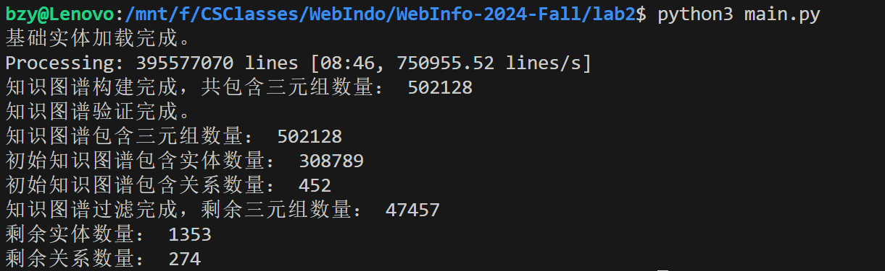

# Web信息处理与应用 Lab2

PB22081571 薄震宇	PB22111613 王翔辉	PB22020514 郭东昊

[TOC]

## 1. 文件组织


## 2. 实验任务

必做：

1. 根据实验一中提供的电影 ID 列表，匹配获得 Freebase 中对应的实体。
2. 从公开图谱中匹配从 Freebase 中抽取的电影实体有关系的实体和关系，生成知识图谱。为保障图谱质量，可以按一定的规则过滤图谱中的实体和关系。
3. 对图谱中的实体和关系做映射并根据映射关系将前面得到的知识图谱映射为由索引值组成的三元组。
4. 基于 baseline 框架代码，完成基于图谱嵌入的模型。需要完成 KG 的构建，实现 TransE 算法，采用多任务方式（KG 损失与 CF 损失相加）对模型进行更新。
5. 分析不同的设计的图谱嵌入方法对知识感知推荐性能的影响，对比分析基础推荐方法和知识感知推荐的实验结果差异。

选做：

1. 将多任务方式更改为迭代优化方式，即 KG 损失与 CF 损失迭代地对模型进行优化。
2. 调研相关综述4，思考如何改进自己的模型，并动手尝试。

## 3. 实验过程

### 3.1 提取实体

这里我们需要根据`douban2fb.txt`文件，匹配获得 Freebase 中对应的实体，一共有 578 个可匹配实体。

我们只需要读取`douban2fb.txt`文件，获取每一行的第二列（表示实体），为其加上前缀`<http://rdf.freebase.com/ns/`即表示电影在 Freebase 中对应的实体，再将这些实体放入一个集合中即可。代码如下：

```python3
def load_base_entities(douban2fb_path):
    """
    获得电影 ID 在 Freebase 中对应的实体集合。
    """
    base_entities = set()
    with open(douban2fb_path, 'r', encoding='utf-8') as f:
        for line in f:
            _, entity = line.strip().split()
            entity_uri = f"<http://rdf.freebase.com/ns/{entity}>"
            base_entities.add(entity_uri)
    print("基础实体加载完成。")
    return base_entities
```

### 3.2 构建知识图谱

这里我们需要以 578 个可匹配实体为起点，通过三元组关联，提取一跳可达的全部实体以形成新的起点集合。将重复两次该步骤所获得的全部实体及对应三元组合并用于后面实验的知识图谱子图。

对于每一跳知识图谱，我们首先需要从 Freebase 中提取所有包含实体的三元组，然后按照一定的规则过滤三元组。下面分别说明这两个步骤。

#### 3.2.1 提取初始图谱

这一步里我们需要从 Freebase 中提取所有包含实体集合中的实体的三元组并返回，考虑到存储空间有限，保存三元组文件时用`gzip`进行压缩，保存的文件以`.txt.gz`为后缀。代码如下：

```python3
def build_kg(freebase_path, kg_output_path, entities_set):
    """
    构建知识图谱，提取与实体集合相关的三元组。

    参数：
    - freebase_path: Freebase 数据路径。
    - kg_output_path: 知识图谱输出路径。
    - entities_set: 实体集合。
    """
    triple_list = []
    with gzip.open(freebase_path, 'rb') as f_in, \
            gzip.open(kg_output_path, 'wb') as f_out:
        # 使用 tqdm 包装文件对象，以显示进度条
        for line in tqdm(f_in, desc="Processing", unit=" lines"):
            line = line.strip()
            h, r, t = line.decode().split('\t')[:3]
            if h in entities_set or t in entities_set:
                f_out.write((h + '\t' + r + '\t' + t + '\n').encode())
                triple_list.append((h, r, t))
    print("知识图谱构建完成，共包含三元组数量：", len(triple_list))
    return triple_list
```

对于第一跳，我们需要从第一步中得到的 578 个实体出发，提取将其作为头或尾与 Freebase 中的三元组，而对于第二跳，我们则需要从第一跳中得到的所有实体出发。

第一跳

#### 3.2.2 过滤知识图谱

为了保障图谱的质量，我们需要对前面得到的图谱进行过滤。我们的过滤条件有：

1. 实体需以`<http://rdf.freebase.com/ns/`为前缀。
2. 实体涉及到三元组至少有10个。
3. 关系至少在50个三元组中出现。

我们可以先遍历三元组，统计实体及关系出现的次数，然后根据条件过滤。

过滤实体的代码如下：

```python3
entity_count = {}
    for h, _, t in triple_list:
        entity_count[h] = entity_count.get(h, 0) + 1
        entity_count[t] = entity_count.get(t, 0) + 1
    selected_entities = {e for e, count in entity_count.items() if e.startswith('<http://rdf.freebase.com/ns/') and count >= min_entity_freq}
```

过滤关系的代码如下：
```python3
relation_count = {}
    for _, r, _ in triple_list:
        relation_count[r] = relation_count.get(r, 0) + 1
    selected_relations = {r for r, count in relation_count.items() if count >= min_relation_freq}
```

最后过滤得到实体在`selected_entities`中并且关系在`selected_relations`中的三元组：

```
filtered_triples = [triple for triple in triple_list if triple[1] in selected_relations and triple[0] in selected_entities and triple[2] in selected_entities]
```

第一跳得到的初始子图及过滤后的结果如下：



由于内存原因，在构建第二跳子图时程序总是中途终止，所以我们只执行了一跳。

### 3.3 图谱映射

这里我们需要根据`douban2fb.txt`中提供的电影 ID 与电影实体的映射关系以及`movie_id_map.txt`中提供的电影 ID 与索引值的映射关系，将电影实体映射到索引值上，并继续对其余实体和关系做映射。

#### 3.3.1 电影实体映射

首先我们需要以电影 ID 为媒介，对电影实体做映射。代码如下：

```python3
def load_movie_id_map(movie_id_map_path, douban2fb_path):
    """
    加载电影ID映射关系。
    """
    douban_id_to_entity_map = load_id_to_entity_map(douban2fb_path)
    movie_id_map = {}
    with open(movie_id_map_path, 'r', encoding='utf-8') as f:
        for line in f:
            douban_id, mapped_id = line.strip().split('\t')
            movie_uri = douban_id_to_entity_map[douban_id]
            movie_id_map[movie_uri] = int(mapped_id)
    return movie_id_map

def load_id_to_entity_map(douban2fb_path):
    """
    加载豆瓣电影ID到实体的映射关系。
    """
    douban_id_to_entity_map = {}
    with open(douban2fb_path, 'r', encoding='utf-8') as f:
        for line in f:
            douban_id, entity = line.strip().split()
            entity_uri = f"<http://rdf.freebase.com/ns/{entity}>"
            douban_id_to_entity_map[douban_id] = entity_uri
    return douban_id_to_entity_map
```

我们首先读取`douban2fb.txt`，将电影 ID 到实体的映射关系存在了字典`douban_id_to_entity_map`中，然后对于每一个电影 ID ，我们可以根据`movie_id_map.txt`获得其对应的索引值，将其对应的电影实体和索引值的映射存在字典`movie_index_map`中。

#### 3.1.2 其余实体和关系映射

对于除去电影实体的其余实体，可以接着电影实体的索引值继续做映射，即从`max(movie_index_map.values()) + 1`开始。对于关系，可以从索引 0 开始映射。

主要是通过下面的函数来得到字典：

```python3
def create_entity_relation_mappings(triple_list, movie_index_map):
    """
    为实体和关系创建索引映射。

    参数：
    - triple_list: 原始三元组列表。
    - movie_id_map: 电影实体到索引的映射字典。

    返回：
    - entity_id_map: 其他实体到索引的映射字典。
    - relation_id_map: 关系到索引的映射字典。
    """
    entity_id_map = {}
    relation_id_map = {}
    current_entity_id = max(movie_index_map.values()) + 1  # 其他实体的起始索引
    current_relation_id = 0

    for h, r, t in triple_list:
        # 映射头实体
        if h not in movie_index_map and h not in entity_id_map:
            entity_id_map[h] = current_entity_id
            current_entity_id += 1
        # 映射尾实体
        if t not in movie_index_map and t not in entity_id_map:
            entity_id_map[t] = current_entity_id
            current_entity_id += 1
        # 映射关系
        if r not in relation_id_map:
            relation_id_map[r] = current_relation_id
            current_relation_id += 1

    return entity_id_map, relation_id_map
```

然后根据得到的实体映射字典和关系映射字典，我们就可以将前面得到的电影图谱映射为由索引值组成的三元组：

```python3
def map_triples_to_ids(triple_list, movie_index_map, entity_id_map, relation_id_map):
    """
    将三元组映射为索引表示。

    参数：
    - triple_list: 原始三元组列表。
    - movie_index_map: 电影实体到索引的映射字典。
    - entity_id_map: 其他实体到索引的映射字典。
    - relation_id_map: 关系到索引的映射字典。

    返回：
    - mapped_triples: 由索引值组成的三元组列表。
    """
    mapped_triples = []
    for h, r, t in triple_list:
        # 映射头实体
        if h in movie_index_map:
            head_id = movie_index_map[h]
        else:
            head_id = entity_id_map[h]

        # 映射尾实体
        if t in movie_index_map:
            tail_id = movie_index_map[t]
        else:
            tail_id = entity_id_map[t]

        # 映射关系
        relation_id = relation_id_map[r]

        mapped_triples.append((head_id, relation_id, tail_id))

    return mapped_triples
```

最后将映射后的三元组保存到`baseline\data\Douban\kg_final.txt`文件中即可。

映射前的知识图谱大小为 6.21 MB，而映射后变为了 693 KB，可见**映射处理大幅压缩了存储空间**。
