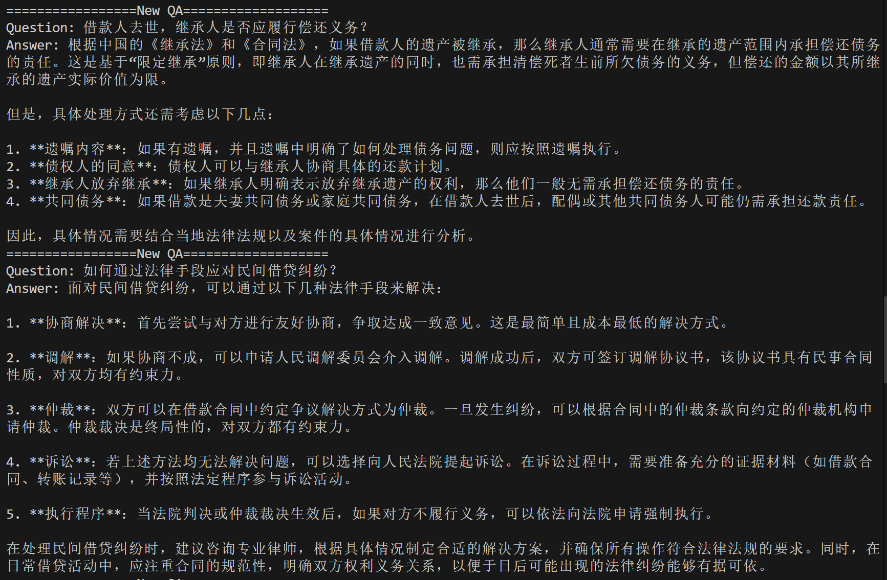

# Web 信息处理与应用 Lab3

PB22081571 薄震宇	PB22111613 王翔辉	PB22020514 郭东昊

[TOC]

## 1. 实验背景

随着人工智能技术的迅猛发展，检索增强生成（Retrieval-Augmented Generation, RAG）系统在知识密集型任务中展现出强大的能力。RAG 系统通过结合信息检索技术与大型语言模型（LLM），能够从外部知识库中提取相关信息，并将其作为上下文输入生成模型，以提供更准确和上下文相关的答案。本实验旨在利用 LangChain 框架，基于公开的法律知识数据库，开发一个简单的 RAG 问答应用示例，以比较大模型的生成式检索与普通检索的区别，并评估引入 RAG 后大模型在专业搜索上的表现。

## 2. 实验介绍

### 2.1 RAG 介绍

RAG 模型由 Facebook AI Research（FAIR）团队于 2020 年首次提出，主要分为三个阶段：

1. **索引（Indexing）**：将外部数据源中的内容转换为向量表示，并存储在向量数据库中。
2. **检索（Retrieval）**：使用用户的查询向量在向量数据库中搜索最相关的信息。
3. **生成（Generation）**：将检索到的信息与用户的查询结合，通过语言模型生成最终的回答。

### 2.2 基于 LangChain 实现 RAG 系统

**LangChain** 是一个用于开发由大语言模型（LLM）支持的应用程序的框架，提供了各种工具和接口，帮助开发者集成和管理语言模型的功能。

本实验通过以下步骤实现 RAG 系统：

1. **数据准备**：加载和清洗法律条文及问答数据，进行文本分割和向量化，并存储在向量数据库中。
2. **数据检索**：根据用户查询，从向量数据库中检索相关文档。
3. **LLM 生成**：将检索到的文档与用户查询结合，生成法律问答。

## 3. 实验内容

### 3.1 数据集说明

我们手动将数据集分为了两个文件，便于处理。

- **law_data.csv**：包含中华人民共和国法律手册最核心的约600条法律条文。
- **qa_data.csv**：包含百度知道约2400条法律问答数据。

### 3.2 任务说明

1. **数据准备阶段**：
    - 数据提取：使用 `CSVLoader` 加载 CSV 文件，处理包含英文逗号和跨行双引号的情况。
    - 数据清洗：替换英文逗号为中文逗号，移除空值和重复项。
    - 文本分割：法律条文每行对应一个法条，问答数据每组问答对应一个整体。
    - 向量化：使用 HuggingFace 的嵌入模型将文本转换为向量。
    - 数据入库：将向量存储到 FAISS 向量数据库中。

2. **数据检索阶段**：
    - TODO
  
3. **LLM 生成阶段**：
    - TODO

## 4. 实验过程

### 4.1 数据准备阶段

**数据分析**：

- law_data.csv
  - 法律条文的文字表述都很专业准确，每行对应一个法条。
  - 有的一个法条就被一对英文双引号包裹，有的多个法条被一对跨行的英文双引号包裹
- qa_data.csv
  - 一组问答用一对跨行的英文双引号"包裹。一组问答一般占两行，有时占三行。

针对以上特征，文本分割和向量化的思路如下： 

- 法律条文每行对应一个向量
- 问答部分每一组问答对应一个向量
- 参数quotechar='"' 指定了双引号作为引用字符，这样 Pandas 在读取 CSV 文件时会将双引号内的内容视为一个整体，即使内容中包含换行符。这样可以确保数据在读取时不会被错误地分割，可以用这个来识别一组问答。 需要注意的是，如果用此方法读取法律条文，法律条文需要每行对应一个向量，故引号包裹的多行法条被读取后，还需要以换行符为分割。

#### 4.1.1 函数 `data_pre`

##### 功能
该函数负责数据提取、清洗、文本分割、向量化以及将文档存储到 FAISS 向量数据库中。

##### 输入参数
- `law_csv_path` (str): `law_data.csv` 文件的路径。
- `qa_csv_path` (str): `qa_data.csv` 文件的路径。
- `faiss_index_path` (str): FAISS 索引文件的保存路径。

##### 输出
- 返回分割并打标签后的文档列表，用于在 `main` 函数中展示示例文档。
- 将 FAISS 索引文件存储在指定的目录下。

##### 具体步骤
1. **加载CSV文件**：
   
    - 使用 `CSVLoader` 分别加载 `law_data.csv` 和 `qa_data.csv`，并指定双引号 `"` 作为引用字符，确保跨行的问答组被正确读取为一个整体。
    - 替换英文逗号 `,` 为中文逗号 `，`，统一标点符号，避免分割时出错。
    
    ```python
    law_loader = CSVLoader(
        file_path=law_csv_path, 
        encoding="utf-8", 
        source_column="data",
        csv_args={
            'delimiter': ',',
            'quotechar': '"',
            'escapechar': '\\'
        }
    )
    
    law_docs = law_loader.load()
    ```
    
3. **文本分割**：
    - 使用 `CharacterTextSplitter` 按换行符 `\n` 分割法律条文，每行对应一个法条。
    - 对问答数据不进行进一步分割，每组问答作为一个整体。
    
    ```python
    text_splitter = CharacterTextSplitter(
        separator="\n",
        chunk_size=1000,
        chunk_overlap=0,
        length_function=len,
    )
    
    law_splits = text_splitter.split_documents(law_docs)
    ```

4. **添加标签**：
    - 为法律条文和问答数据分别添加标签 `law` 和 `qa`，便于后续区分和检索。
    
    ```python
    for doc in law_splits:
        doc.metadata["label"] = "law"
    for doc in qa_docs:
        doc.metadata["label"] = "qa"
        
    documents = law_splits + qa_docs
    ```

5. **向量化和数据入库**：
   
    - 检查 FAISS 索引目录是否存在，若不存在则创建并进行向量化和存储。
      - 若存在则不进行向量化和存储，**因为实在太费时间了，一次要十几分钟**。仅作为被main函数调用输出示例。
    
    - 使用 HuggingFace 的 `BAAI/bge-base-en-v1.5` 嵌入模型将文档转换为向量。
    - 使用 FAISS 向量数据库存储向量，并保存索引文件。
    
    ```python
    if not os.path.exists(faiss_index_path):
        os.makedirs(faiss_index_path)
        embeddings = HuggingFaceEmbeddings(model_name="BAAI/bge-base-en-v1.5")
        vectorstore = FAISS.from_documents(documents, embeddings)
        vectorstore.save_local(faiss_index_path)
    ```

#### 4.1.2 函数 `main`

##### 功能
该函数调用 `data_pre` 函数进行数据预处理，并展示部分分割后的文档示例。

##### 具体步骤
1. **定义文件路径**：
   
    ```python
    law_csv_path = "law_data.csv"
    qa_csv_path = "qa_data.csv"
    faiss_index_path = "faiss_index"
    ```
    
2. **调用数据预处理函数**：
    ```python
    documents = data_pre(law_csv_path, qa_csv_path, faiss_index_path)
    ```

3. **分组展示文档**：
   
    - 提取前10条法律条文和前10组问答数据进行展示。
    
    ```python
    law_examples = [doc for doc in documents if doc.metadata['label'] == 'law'][:10]
    qa_examples = [doc for doc in documents if doc.metadata['label'] == 'qa'][:10]
    ```
    
4. **打印示例文档**：
   
    - 分别打印法律条文和问答示例，以验证数据分割和标签添加的效果。
    
    ```python
    print("法律条文示例：\n")
    for i, doc in enumerate(law_examples, 1):
        print(f"文档 {i}:")
        print(f"标签: {doc.metadata['label']}")
        print(f"内容: {doc.page_content}\n")
    
    print("问答示例：\n")
    for i, doc in enumerate(qa_examples, 1):
        print(f"文档 {i}:")
        print(f"标签: {doc.metadata['label']}")
        print(f"内容: {doc.page_content}\n")
    ```

### 4.2 数据检索阶段

这一阶段我们需要根据用户的提问，通过高效的检索方法，召回与提问最相关的知识。

首先我们需要加载前面保存的向量化模型与 FAISS 索引，然后使用 similarity_search 方法即可实现相似性检索。

代码如下：

```python
# 加载向量化模型
embeddings = HuggingFaceEmbeddings(model_name="moka-ai/m3e-base")

# 加载 FAISS 索引
vectorstore = FAISS.load_local(faiss_index_path, embeddings, allow_dangerous_deserialization=True)

# 执行相似性检索
similar_docs = vectorstore.similarity_search(query, k=top_k)
```

其中 `k` 参数用于指定相似性搜索中返回的最相似文档的数量。

### 4.3 LLM 生成阶段

#### 4.3.1 使用 RAG

这一阶段我们需要将检索得到的相关知识注入 prompt，大模型参考当前提问和相关知识，生成相应的答案。这里的关键在于 prompt 的构造。

我们使用的**通义千问-plus** 模型。根据官方文档的介绍，模型的基本调用方法如下：

```python
client = OpenAI(
    # 若没有配置环境变量，请用百炼API Key将下行替换为：api_key="sk-xxx",
    api_key=os.getenv("DASHSCOPE_API_KEY"),
    base_url="https://dashscope.aliyuncs.com/compatible-mode/v1",
)

completion = client.chat.completions.create(
    model="qwen-plus",  # 模型列表：https://help.aliyun.com/zh/model-studio/getting-started/models
    messages=[
        {'role': 'system', 'content': 'You are a helpful assistant.'},
        {'role': 'user', 'content': '你是谁？'}
        ]
)
print(completion.choices[0].message.content)
```

所以我们可以将检索出的与问题相关的文档做一些处理后提供给大模型，并告诉大模型只能使用检索到的上下文来回答问题。

代码如下：

```python
try:
    client = OpenAI(
        api_key=os.getenv("DASHSCOPE_API_KEY"),
        base_url="https://dashscope.aliyuncs.com/compatible-mode/v1",
    )

    context_str = "\n\n".join([f"{i+1}. {doc.page_content.replace('data: ', '')}" for i, doc in enumerate(retrieved_docs)])
    completion = client.chat.completions.create(
        model="qwen-plus",
        messages=[
        {'role': 'system', 'content': '你是专业的法律知识问答助手。你需要使用以下检索到的上下文片段来回答问题，检索到的上下文如下：'},
        {'role': 'system', 'content': context_str},
        {'role': 'system', 'content': '你只能使用上述上下文来回答下面的问题，禁止根据常识和已知信息回答问题。如果上下文中没有足够依据，直接回答“未找到相关答案”。'},
        {'role': 'user', 'content': query}
        ]
    )
    print("=================New QA===================")
    print("Context:\n", context_str)
    print("Question:", query)
    res = completion.choices[0].message.content
    print("Answer:", res)
except Exception as e:
    print(f"错误信息：{e}")
    print("请参考文档：https://help.aliyun.com/zh/model-studio/developer-reference/error-code")
    res = "ERROR"
```

其中使用了以下代码来处理检索后得到的文档内容以去除文档内容中开头的 `data:` 并分隔文档：

```python
context_str = "\n\n".join([f"{i+1}. {doc.page_content.replace('data: ', '')}" for i, doc in enumerate(retrieved_docs)])
```

#### 4.3.2 不使用 RAG

为了对比 RAG 与普通检索的区别以及引入 RAG 前后大模型在专业搜索上的区别，我们还实现了不使用 RAG 技术时即直接询问大模型时大模型的回答结果。

在代码实现上，只需要在调用大模型时不向它提供额外的信息即可，也不做额外的要求，也就是通过下面的代码调用大模型进行回答：

```python
response = client.chat.completions.create(
    model="qwen-turbo",
    messages=[
        {'role': 'system', 'content': '你是一名专业的法律顾问，请直接回答下面的问题：'},
        {'role': 'user', 'content': question}
    ]
)
```

### 4.4 选做：自己编写 CoT Prompt 引导大模型

在前面的基础上，增加一条信息，让大模型一步一步推导出答案，再给出最终答案。这里我们借鉴了 chatGPT-o1 的“思想链”的方法，让大模型像人类一样思考，通过逐步分解问题来解决问题。我们只需要修改给大模型的信息如下：

```python
completion = client.chat.completions.create(
    model="qwen-plus",
    messages=[
    {'role': 'system', 'content': '你是专业的法律知识问答助手。你需要使用以下检索到的上下文片段来回答问题，检索到的上下文如下：'},
    {'role': 'system', 'content': context_str},
    {'role': 'system', 'content': '你只能使用上述上下文来回答下面的问题，禁止根据常识和已知信息回答问题。如果上下文中没有足够依据，直接回答“未找到相关答案”。'},
    {'role': 'user', 'content': query},
    {'role': 'system', 'content': '请根据上下文和问题一步一步推导出答案。'}
    ]
)
```

## 5. 实验结果

### 5.1 普通检索

各个问题的相似性检索结果如下：

```
Question: 借款人去世，继承人是否应履行偿还义务？
相似性检索结果:
文档 1:
内容: 收数公司提醒：债务人去世了债务怎么追讨
债务以他的遗产实际价值为限。超过遗产实际价值部分，继承人自愿偿还的不在此限。

文档 2:
内容: 身负债务的继承人放弃继承遗产的行为，有效吗
《继承法》第二条规定“继承从被继承人死亡时开始。”第二十五条规定“继承开始后，继承人放弃继承的，应当在遗产处理前，作出放弃继承的表示 。没有表示的，视为接受继承。”从上述法律条文可以看出，继承人对被继承人遗产享有处分权的起始时点，应为被继承人死亡之时。被继承人尚在 人世时，继承人对被继承人的财产（也即遗产并没有处分的权利）。因此，继承人在被继承人在世时做出放弃遗产继承的意思表示，属于无权处分行为，依法当属无效。当然，如果继承人在被继承人死亡后，遗产处理前，作出放弃的意思表示，则是具有法律效力的。

文档 3:
内容: 辩护人的范围是哪些，辩护人要承担什么责任
犯罪嫌疑人、被告人除自己行使辩护权以外，还可以委托一至二人作为辩护人。下列的人可以被委托为辩护人：1、律师；2、人民团体或者犯罪嫌疑人、被告人所在单位推荐的人；3、犯罪嫌疑人、被告人的监护人、亲友。而对于辩护人要承担什么责任这个问题，结合我国法律的有关规定来看， 辩护人的责任具体包括以下几个方面：1、只能依据事实和法律进行辩护，不得捏造事实和歪曲法律。2、提出证明犯罪嫌疑人、被告人无罪、罪轻或者减轻、免除其刑事责任的材料和意见。3、依法只维护犯罪嫌疑人、被告人的合法权益。4、辩护人只有辩护的职责，没有控诉的义务。

文档 4:
内容: 怎样为偷盗未遂者辩护
尊敬的审判员：我叫###，是本案被告人###的辩护人。辩护人接受指派后依法多次会见了被告人###，详细地查阅了本案全部卷宗材料，对案情有了 比较全面、客观的了解。辩护人结合今天的庭审情况，根据质证证据证明的事实与相关法律规定发表如下辩护意见，供法庭审理时参考：一、关于本案的事实，根据我国现行法律关于盗窃罪的规定，以及本案相关证据来看，被告人###已经涉嫌构成盗窃犯罪。同时，鉴于被告人已对所犯罪行供认 不讳。因此，辩护人对公诉机关指控###犯盗窃罪无异议。二、辩护人认为本案被告人###具有如下法定和酌定的从轻或者减轻的情节，请合议庭在量刑时予以充分考虑。首先，被告人具有法定的从轻或减轻情节，应减轻处罚。在本案中，被告人XX具有自首情节，且已被公诉机关确认。按照我国刑法第六十七条第一款的规定：对于自首的犯罪嫌疑人，可以从轻或者减轻处罚。辩护人认为：对本案被告人应减轻处罚。其次，被告人具有酌定的从轻或减轻处罚情节。主要有如下：1、被告人具有悔罪表现，愿意痛改前非，重新做人。从被告人的供述中可以看出，被告人在案发后能够积极主动 、全部、彻底地向司法机关交待自己的犯罪行为，说明被告人已经认识到自己犯罪行为的严重性，有改过自新、重新做人的真实愿望。在看守所羁押期间，被告人服从管理，能积极协助管理人员开展工作。从今天的庭审情况来看，被告人的诚恳交代、认罪伏法的态度也是有目共睹的。根据最高法、最高检和司法部颁布的《关于适用简易程序审理公诉案件的若干意见》第九条关于“人民法院对自愿认罪的被告人，酌情予以从轻处罚”之规定，辩护人认为：被告人的认罪态度完全符合相关法律规定，恳请法院在对被告人量刑时予以充分考虑。2、被告人的主观恶性不大，且有客观原因尤其赃 物直接使用于工作的特性，量刑时应与一般盗窃案有所从轻处罚的区别。3、本案被告人的犯罪行为没有造成严重的社会后果。综上，辩护人认为： 被告人构成犯罪，但其主观恶性不大，具有自首情节，确有悔改行为，具备刑法关于缓刑的条件。因此，对被告人应减轻处罚，并建议宣告缓刑，给被告人一个改过自新、重新做人的机会。此致###人民法院辩护人：######X年XX月XX日

文档 5:
内容: 盗窃案怎么辩护能最好
尊敬的审判员：我叫###，是本案被告人###的辩护人。辩护人接受指派后依法多次会见了被告人###，详细地查阅了本案全部卷宗材料，对案情有了 比较全面、客观的了解。辩护人结合今天的庭审情况，根据质证证据证明的事实与相关法律规定发表如下辩护意见，供法庭审理时参考：一、关于本案的事实，根据我国现行法律关于盗窃罪的规定，以及本案相关证据来看，被告人###已经涉嫌构成盗窃犯罪。同时，鉴于被告人已对所犯罪行供认 不讳。因此，辩护人对公诉机关指控###犯盗窃罪无异议。二、辩护人认为本案被告人###具有如下法定和酌定的从轻或者减轻的情节，请合议庭在量刑时予以充分考虑。首先，被告人具有法定的从轻或减轻情节，应减轻处罚。在本案中，被告人XX具有自首情节，且已被公诉机关确认。按照我国刑法第六十七条第一款的规定：对于自首的犯罪嫌疑人，可以从轻或者减轻处罚。辩护人认为：对本案被告人应减轻处罚。其次，被告人具有酌定的从轻或减轻处罚情节。主要有如下：1、被告人具有悔罪表现，愿意痛改前非，重新做人。从被告人的供述中可以看出，被告人在案发后能够积极主动 、全部、彻底地向司法机关交待自己的犯罪行为，说明被告人已经认识到自己犯罪行为的严重性，有改过自新、重新做人的真实愿望。在看守所羁押期间，被告人服从管理，能积极协助管理人员开展工作。从今天的庭审情况来看，被告人的诚恳交代、认罪伏法的态度也是有目共睹的。根据最高法、最高检和司法部颁布的《关于适用简易程序审理公诉案件的若干意见》第九条关于“人民法院对自愿认罪的被告人，酌情予以从轻处罚”之规定，辩护人认为：被告人的认罪态度完全符合相关法律规定，恳请法院在对被告人量刑时予以充分考虑。2、被告人的主观恶性不大，且有客观原因尤其赃 物直接使用于工作的特性，量刑时应与一般盗窃案有所从轻处罚的区别。3、本案被告人的犯罪行为没有造成严重的社会后果。综上，辩护人认为： 被告人构成犯罪，但其主观恶性不大，具有自首情节，确有悔改行为，具备刑法关于缓刑的条件。因此，对被告人应减轻处罚，并建议宣告缓刑，给被告人一个改过自新、重新做人的机会。此致###人民法院辩护人：######X年XX月XX日

Question: 如何通过法律手段应对民间借贷纠纷？
相似性检索结果:
文档 1:
内容: 民法商法-消费者权益保护法2013-10-25：第二十六条 经营者在经营活动中使用格式条款的，应当以显著方式提请消费者注意商品或者服务的数量和质量、价款或者费用、履行期限和方式、安全注意事项和风险警示、售后服务、民事责任等与消费者有重大利害关系的内容，并按照消费者的要求予以说明。,经营者不得以格式条款、通知、声明、店堂告示等方式，作出排除或者限制消费者权利、减轻或者免除经营者责任、加重消费者责 任等对消费者不公平、不合理的规定，不得利用格式条款并借助技术手段强制交易。,格式条款、通知、声明、店堂告示等含有前款所列内容的，其 内容无效。

文档 2:
内容: 民法商法-商标法2019-04-23：第七条 申请注册和使用商标，应当遵循诚实信用原则。,商标使用人应当对其使用商标的商品质量负责。各级 工商行政管理部门应当通过商标管理，制止欺骗消费者的行为。

文档 3:
内容: 民法商法-消费者权益保护法2013-10-25：第十九条 经营者发现其提供的商品或者服务存在缺陷，有危及人身、财产安全危险的，应当立即向有关行政部门报告和告知消费者，并采取停止销售、警示、召回、无害化处理、销毁、停止生产或者服务等措施。采取召回措施的，经营者应当承担消费者因商品被召回支出的必要费用。

文档 4:
内容: 民法典-婚姻家庭编：第一千零九十六条 监护人送养孤儿的，应当征得有抚养义务的人同意。有抚养义务的人不同意送养、监护人不愿意继续履行监护职责的，应当依照本法第一编的规定另行确定监护人。

文档 5:
内容: 民法商法-消费者权益保护法2013-10-25：第六十一条 国家机关工作人员玩忽职守或者包庇经营者侵害消费者合法权益的行为的，由其所在单位或者上级机关给予行政处分；情节严重，构成犯罪的，依法追究刑事责任。

Question: 没有赡养老人就无法继承财产吗？
相似性检索结果:
文档 1:
内容: 民法商法-个人独资企业法1999-08-30：第十七条 个人独资企业投资人对本企业的财产依法享有所有权，其有关权利可以依法进行转让或继承。

文档 2:
内容: 服刑犯人是否享有代位继承权
服刑人员与正常人一样享有继承权。只有继承法第7条规定的人，才丧失继承权。《继承法》第七条继承人有下列行为之一的，丧失继承权：(一)故 意杀害被继承人的；(二)为争夺遗产而杀害其他继承人的；(三)遗弃被继承人的，或者虐待被继承人情节严重的；(四)伪造、篡改或者销毁遗嘱，情节严重的。

文档 3:
内容: 只有一人不愿放弃，这个房子我怎样继承
房产继承是指按照《继承法》的规定，是指依照法定程序把被继承人遗留房屋所有权及其土地使用权转移归继承人所有的法律行为。房产继承，是所有权及使用权继受取得方式的一种。我国的《继承法》中所列遗产的范围中有房屋。所谓房屋的继承是指被继承人死亡后，其房产归其遗嘱继承人或法定继承人所有。因此，只有被继承人的房屋具有合法产权才能被继承。当继承发生时，如果有多个继承人，则应按遗嘱及有关法律规定进行折产，持原产权证、遗嘱等资料到主管部门办理过户手续。办理房屋的产权过户需要有效的证明和具体的步骤：需要证明1，老人的遗产，是所有继承人的 共同财产。2，继承人对共有的财产的分割协议，只要每个继承人同意并签字，即可产生效力，任何继承人都不得违约。3，如果每个继承人对继承的共有财产分割，无异议，可以凭此协议办理过户手续。

文档 4:
内容: 诉讼与非诉讼程序法-刑事诉讼法2018-10-26：第三十三条 犯罪嫌疑人、被告人除自己行使辩护权以外，还可以委托一至二人作为辩护人。下列的人可以被委托为辩护人：,（一）律师；,（二）人民团体或者犯罪嫌疑人、被告人所在单位推荐的人；,（三）犯罪嫌疑人、被告人的监护人、 亲友。,正在被执行刑罚或者依法被剥夺、限制人身自由的人，不得担任辩护人。,被开除公职和被吊销律师、公证员执业证书的人，不得担任辩护人，但系犯罪嫌疑人、被告人的监护人、近亲属的除外。

文档 5:
内容: 刑法-刑法：第二百六十条之一 对未成年人、老年人、患病的人、残疾人等负有监护、看护职责的人虐待被监护、看护的人，情节恶劣的，处三年以下有期徒刑或者拘役。,单位犯前款罪的，对单位判处罚金，并对其直接负责的主管人员和其他直接责任人员，依照前款的规定处罚。,有第一款行为，同时构成其他犯罪的，依照处罚较重的规定定罪处罚。

Question: 谁可以申请撤销监护人的监护资格？
相似性检索结果:
文档 1:
内容: 如果欠债的人死了，那债务还用家里人偿还吗！
请知道的麻烦回答一下，谢谢了
依据《中华人民共和国继承法》33条、继承遗产应当先行清偿被继承人生前所应当缴纳的税费及债务，缴纳税费及债务以遗产的实际价值为限。超出部分，继承人自愿清偿的不在此限。因此，债务人死亡，其生前所负的债务，以其遗产进行偿还，偿还的范围以遗产的实际价值为限，超出部分继承人自愿偿还的不受限制。但是如果债务人的法定继承人不愿偿还，那么债权人的债权在使用债务人遗产偿还后不足部分或者债务人无遗产可以偿还，债权人的债权或债权不足部分将彻底消灭。无法得到补偿

文档 2:
内容: 老人遗产继承问题。
老人遗留下一间房子，约20平米，是祖先传下来的，没有房产证。老人生前说是他两的养口。现在老大占用不归还。请问我有继承权吗？
有继承权。法定继承是指在被继承人没有对其遗产的处理立有遗嘱的情况下，由法律直接规定继承人的范围、继承顺序、遗产分配的原则的一种继承形式。法定继承又称为无遗嘱继承，是相对于遗嘱继承而言的，语源自罗马法的su##############ta，亦即非遗嘱继承。法定继承是遗嘱继承以外的依照法律的直接规定将遗产转移给继承人的一种遗产继承方式。在法定继承中，可参加继承的继承人、继承人参加继承的顺序、继承人应继承的遗产份额以及遗产的分配原则，都是由法律直接规定的。因而法定继承并不直接体现被继承人的意志，仅是法律依推定的被继承人的意思将其遗产由其亲近亲属继承。

文档 3:
内容: 盗窃罪一审辩护词怎么写才能有利于当事人
尊敬的审判员：我叫###，是本案被告人###的辩护人。辩护人接受指派后依法多次会见了被告人###，详细地查阅了本案全部卷宗材料，对案情有了 比较全面、客观的了解。辩护人结合今天的庭审情况，根据质证证据证明的事实与相关法律规定发表如下辩护意见，供法庭审理时参考：一、关于本案的事实，根据我国现行法律关于盗窃罪的规定，以及本案相关证据来看，被告人###已经涉嫌构成盗窃犯罪。同时，鉴于被告人已对所犯罪行供认 不讳。因此，辩护人对公诉机关指控###犯盗窃罪无异议。二、辩护人认为本案被告人###具有如下法定和酌定的从轻或者减轻的情节，请合议庭在量刑时予以充分考虑。首先，被告人具有法定的从轻或减轻情节，应减轻处罚。在本案中，被告人XX具有自首情节，且已被公诉机关确认。按照我国刑法第六十七条第一款的规定：对于自首的犯罪嫌疑人，可以从轻或者减轻处罚。辩护人认为：对本案被告人应减轻处罚。其次，被告人具有酌定的从轻或减轻处罚情节。主要有如下：1、被告人具有悔罪表现，愿意痛改前非，重新做人。从被告人的供述中可以看出，被告人在案发后能够积极主动 、全部、彻底地向司法机关交待自己的犯罪行为，说明被告人已经认识到自己犯罪行为的严重性，有改过自新、重新做人的真实愿望。在看守所羁押期间，被告人服从管理，能积极协助管理人员开展工作。从今天的庭审情况来看，被告人的诚恳交代、认罪伏法的态度也是有目共睹的。根据最高法、最高检和司法部颁布的《关于适用简易程序审理公诉案件的若干意见》第九条关于“人民法院对自愿认罪的被告人，酌情予以从轻处罚”之规定，辩护人认为：被告人的认罪态度完全符合相关法律规定，恳请法院在对被告人量刑时予以充分考虑。2、被告人的主观恶性不大，且有客观原因尤其赃 物直接使用于工作的特性，量刑时应与一般盗窃案有所从轻处罚的区别。3、本案被告人的犯罪行为没有造成严重的社会后果。综上，辩护人认为： 被告人构成犯罪，但其主观恶性不大，具有自首情节，确有悔改行为，具备刑法关于缓刑的条件。因此，对被告人应减轻处罚，并建议宣告缓刑，给被告人一个改过自新、重新做人的机会。此致###人民法院辩护人：######X年XX月XX日

文档 4:
内容: 亲戚可以做遗嘱的证明人吗
亲戚可以作为遗嘱的见证人，但是必须符合法律规定的充当见证人的条件，即该亲戚必须是完全民事行为能力人，且不是立遗嘱人的继承人或与继承人有利害关系的人。只要符合这些条件立遗嘱人的亲戚就能作为遗嘱的见证人。相关法律可参考：《中华人民共和国继承法》第十八条下列人员不能作为遗嘱见证人：（一）无行为能力人、限制行为能力人（二）继承人、受遗赠人（三）与继承人、受遗赠人有利害关系的人。《中华人民共和国继承法》司法解释36．继承人、受遗赠人的债权人、债务人，共同经营的合伙人，也应当视为与继承人、受遗赠人有利害关系，不能作为遗嘱的见证人。

文档 5:
内容: 遗嘱可以父母两人写在一起吗？
遗嘱可以父母两人写在一起吗？
在遗产分配的问题上法院是遵循被继承人意愿的，遗嘱必须是在被继承人意识清醒有完全行事能力的情况下自愿立的。且遗嘱的内容不得侵犯他人人身权益，更不可以有非法要求，被继承人只能处决属于自己的财产（例如夫妻共同财产只能处决属于自己的那份），如果是书面遗嘱最好去公证处公证一下1、夫妻的共同财产需要上方共同同意，可以写在一起，也可以先做一份财产公证，最好是分别写一份2、法律上是以最后所立遗嘱内容为准执行的3、放弃遗产继承需要放弃的继承人去公证处或请律师公证，书面声明，也是在要在自愿的基础上另外，在没有遗嘱的情况下，被继承人的子女 配偶父母为第一序列继承人，其中包括继子女继父母，养子女和养父母，亲生子女即便是私生子，也有权继承与他有血缘关系的被继承人的遗产孙子属第二继承序列，在有第一继承人时第二序列继承人不继承，如果有遗嘱，那继承人的意见没用，必须是被继承人的自愿真实意向才行，未成年也有权继承，如果子女未尽到赡养义务或由虐待老人等其他恶劣行为法院有权剥夺他的继承权将他的那份分给其余的继承人

Question: 你现在是一个精通中国法律的法官，请对以下案件做出分析：经审理查
                    明：被告人 xxx 于 2017 年 12 月，多次在本市 xxx 盗窃财物。具体事实如下：（一）2017 年 12 月 9 日 15 时许，被告人 xxx 在 xxx 店内，盗窃
                    白色毛衣一件（价值人民币 259 元）。现赃物已起获并发还。（二）20
                    17 年 12 月 9 日 16 时许，被告人 xx 在本市 xxx 店内，盗窃米白色大衣
                    一件（价值人民币 1199 元）。现赃物已起获并发还。（三）2017 年 12
                    月 11 日 19 时许，被告人 xxx 在本市 xxx 内，盗窃耳机、手套、化妆镜
                    等商品共八件（共计价值人民币 357.3 元）。现赃物已起获并发还。（四）
                    2017 年 12 月 11 日 20 时许，被告人 xx 在本市 xxxx 内，盗窃橙汁、牛
                    肉干等商品共四件（共计价值人民币 58.39 元）。现赃物已起获并发还。
                    2017 年 12 月 11 日，被告人 xx 被公安机关抓获，其到案后如实供述了
                    上述犯罪事实。经鉴定，被告人 xxx 被诊断为精神分裂症，限制刑事责
                    任能力，有受审能力。
相似性检索结果:
文档 1:
内容: 怎样能够申请减刑，请求法院减刑申请怎么写
一、怎样能够申请减刑《中华人民共和国刑法》第七十八条规定，被判处管制、拘役、有期徒刑、无期徒刑的犯罪分子，在执行期间，如果认真遵守监规，接受教育改造，确有悔改表现的，或者有立功表现的，可以减刑;有下列重大立功表现之一的，应当减刑：(一)阻止他人重大犯罪活动的;(二)检举监狱内外重大犯罪活动，经查证属实的;(三)有发明创造或者重大技术革新的;(四)在日常生产、生活中舍己救人的;(五)在抗御自然灾害或者排 除重大事故中，有突出表现的;(六)对国家和社会有其他重大贡献的。二、请求法院减刑申请怎么写减刑建议申请书是由监狱向法院提请的，只有符 合减刑的条件监狱才会出面向法院提交减刑建议申请书。置于采纳与否在于合议庭或者法官了。只需要把真实的情况写出来，说明真情才会打动法官。可以简写一下服刑人员自己的犯罪经历、入狱服刑后的良好表现、家庭情况等综合因素都考虑一下。主要应该言明自己的犯罪行为给受害人带来的伤害或者给国家和社会造成的损失，一直心怀愧疚之情，在狱中的铁窗前，每每想起，悔恨不已。深知犯罪行为害人害己，所以痛定思痛，决心痛改前非，以洗心革面，希望法官能够给自己一次重新做人的机会，以便将来能够更好的服务社会，造福社会。服刑至今，不至于再危害社会，希望获得假释后，自己能够承担起抚养孩子、赡养老人的义务!古语有云：树欲静而风不止，子欲养而亲不待。不希望这样的事情会发生在自己身上。讲明自 己出狱后一定痛改前非，好好做人。希望监狱方面也能够积极的向法院提交减刑建议申请书。

文档 2:
内容: 打借条时要注意哪些问题，写借条要注意的问题有哪些
一、打借条时要注意哪些问题借条是凭证，打条收条应谨慎借条是借款人向出借人出具的借款书面凭证。现实生活中，借条也会被一些别有用心，见钱眼开的人，用来作为欺诈钱财的手段，从而使你遭受救济损失。此外，还有两个与出借款物有关的问题需要引起朋友们注意：1、借款时如果明知 对方将用于非法活动，不要借款给对方。依据我国法律规定，该借款不受法律保护。在对方不还钱的情况下无法通过诉讼途径予以保护。2、对约定 有还款期限的借条，要在还款期限届满之后两年内主张权利，即向人民法院起诉。根据我国法律规定，当事人请求人民法院保护民事权利的诉讼时效期间为两年，如果借款人在借款到期两年后向人民法院起诉，却没有诉讼时效中止，中断，延长情形的，就会丧失胜诉权。二、写借条要注意的问题有哪些规范的借条要具备哪些内容：1、应写清楚借款人和放款人的法定全名；2、应写清楚借款金额，包括大写和小写的金额；3、应写清楚借款时 间期限，包括借款的起止年月日和明确的借款期限；4、应写清楚还款的具体年月日；5、应写清楚借款的利息，应有明确的年利率或月利率，最终应支付的借款利息总额（包括大写和小写金额）等约定；6、应写清楚借款本息偿还的年月日时间及付款方式；7、应有借款本人亲自签章、手印或亲笔书写的签字。

文档 3:
内容: 刑法规定多少岁负刑事责任
分为三个阶段：1、完全不负刑事责任年龄：14周岁以下。2、相对不负刑事责任年龄：14-16周岁，在这个年龄阶段的未成年人犯故意杀人，抢劫， 强奸，贩毒，放火，投放危险物质罪，爆炸，故意伤害致人重伤死亡的应当承担刑事责任。3、完全负刑事责任年龄：16周岁以上。在这个年龄阶段 的人犯任何罪都应当承担刑事责任。另外，18周岁以下统称为：减轻刑事责任年龄。在这个年龄段犯罪的都应当视情节从轻减轻处罚。附：《中华人民共和国刑法》第十七条已满十六周岁的人犯罪，应当负刑事责任。已满十四周岁不满十六周岁的人，犯故意杀人、故意伤害致人重伤或者死亡、强奸、抢劫、贩卖毒品、放火、爆炸、投毒罪的，应当负刑事责任。已满十四周岁不满十八周岁的人犯罪，应当从轻或者减轻处罚。因不满十六周岁不予刑事处罚的，责令他的家长或者监护人加以管教；在必要的时候，也可以由政府收容教养。回答者注：投毒罪已由《刑法》修正案3修改为投放危 险物质罪。

文档 4:
内容: 未成年人打架被判刑会减轻吗我有个朋友17
《中华人民共和国刑法》第十七条【刑事责任年龄】已满十六周岁的人犯罪，应当负刑事责任。已满十四周岁不满十六周岁的人，犯故意杀人、故意伤害致人重伤或者死亡、强奸、抢劫、贩卖毒品、放火、爆炸、投毒罪的，应当负刑事责任。已满十四周岁不满十八周岁的人犯罪，应当从轻或者减轻处罚。因不满十六周岁不予刑事处罚的，责令他的家长或者监护人加以管教;在必要的时候，也可以由政府收容教养。已满七十五周岁的人故意犯 罪的，可以从轻或者减轻处罚;过失犯罪的，应当从轻或者减轻处罚。第六十二条【从重处罚与从轻处罚】犯罪分子具有本法规定的从重处罚、从轻 处罚情节的，应当在法定刑的限度以内判处刑罚。第六十三条【减轻处罚】犯罪分子具有本法规定的减轻处罚情节的，应当在法定刑以下判处刑罚; 本法规定有数个量刑幅度的，应当在法定量刑幅度的下一个量刑幅度内判处刑罚。犯罪分子虽然不具有本法规定的减轻处罚情节，但是根据案件的特殊情况，经最高人民法院核准，也可以在法定刑以下判处刑罚。

文档 5:
内容: 诉讼与非诉讼程序法-民事诉讼法2021-12-24：第一百五十四条 有下列情形之一的，终结诉讼：,（一）原告死亡，没有继承人，或者继承人 放弃诉讼权利的；,（二）被告死亡，没有遗产，也没有应当承担义务的人的；,（三）离婚案件一方当事人死亡的；,（四）追索赡养费、扶养费、 抚养费以及解除收养关系案件的一方当事人死亡的。

Question: 你现在是一个精通中国法律的法官，请对以下案件做出分析：2012 年 5月 1 日，原告 xxx 在被告 xxxx 购买“玉兔牌”香肠 15 包，其 中价值 558.6 元的 14 包香肠已过保质期。xxx 到收银台结账后，即径直到服务台索赔，后因协商未果诉至法院，要求 xxxx 店支付 14 包香肠售 价十倍的赔偿金 5586 元。
相似性检索结果:
文档 1:
内容: 诈骗29#00未遂会判多久
诈骗未遂要根据具体案情分析，参考如下《中华人民共和国刑法》第五节金融诈骗罪第一百九十二条以非法占有为目的，使用诈骗方法非法集资，数额较大的，处五年以下有期徒刑或者拘役，并处二万元以上二十万元以下罚金；数额巨大或者有其他严重情节的，处五年以上十年以下有期徒刑，并处五万元以上五十万元以下罚金；数额特别巨大或者有其他特别严重情节的，处十年以上有期徒刑或者无期徒刑，并处五万元以上五十万元以下罚金或者没收财产。第一百九十三条有下列情形之一，以非法占有为目的，诈骗银行或者其他金融机构的贷款，数额较大的，处五年以下有期徒刑或者拘役，并处二万元以上二十万元以下罚金；数额巨大或者有其他严重情节的，处五年以上十年以下有期徒刑，并处五万元以上五十万元以下罚金；数额特别巨大或者有其他特别严重情节的，处十年以上有期徒刑或者无期徒刑，并处五万元以上五十万元以下罚金或者没收财产：（一）编造引进资金、项目等虚假理由的；（二）使用虚假的经济合同的；（三）使用虚假的证明文件的；（四）使用虚假的产权证明作担保或者超出抵押物价值重复担保的；（五）以其他方法诈骗贷款的。第一百九十四条有下列情形之一，进行金融票据诈骗活动，数额较大的，处五年以下有期徒刑或者拘役，并处二万元以上二十万元以下罚金；数额巨大或者有其他严重情节的，处五年以上十年以下有期徒刑，并处五万元以上五十万元以下罚金；数额特别巨大或者有其他特别严重情节的，处十年以上有期徒刑或者无期徒刑，并处五万元以上五十万元以下罚金或者没收财产：（一）明知是伪造、变造的汇票、本票、支票而使用的；（二）明知是作废的汇票、本票、支票而使用的；（三）冒用他人的汇票、本票、支票的；（四）签发空头支票或者与其预留印鉴不符的支票，骗取财物的；（五）汇票、本票的出票人签发无资金保证的汇票、本票或者在出票时作虚假记载，骗取财物的。使用伪造、变造的委托收款凭证、汇款凭证、银行存单等其他银行结算凭证的，依照前款的规定处罚。第一百九十五条有下列情形之一，进行信用证诈骗活动的，处五年以下有期徒刑或者拘役，并处二万元以上二十万元以下罚金；数额巨大或者有其他严重情节的，处五年以上十年以下有期徒刑，并处五万元以上五十万元以下罚金；数额特别巨大或者有其他特别严重情节的，处十年以上有期徒刑或者无期徒刑，并处五万元以上五十万元以下罚金或者没收财产：（一）使用伪造、变造的信用证或者附随的单据、文件的；（二）使用作废的信用证的；（三）骗取信用证的；（四）以其他方法进行信用证诈骗活动的。一百九十六条有下列情形之一，进行信用卡诈骗活动，数额较大的，处五年以下有期徒刑或者拘役，并处二万元以上二十万元以下罚金；数额巨大或者有其他严重情节的，处五年以上十年以下有期徒刑，并处五万元以上五十万元以下罚金；数额特别巨大或者有其他特别严重情节的，处十年以上有期徒刑或者无期徒刑，并处五万元以上五十万元以下罚金或者没收财产：（一）使用伪造的信用卡，或者使用以虚假的身份证明骗领的信用卡的；（二）使用作废的信用卡的；（三）冒用他人信用卡的；（四）恶意透支的。前款所称恶意透支，是指持卡人以非法占有为目的，超过规定限额或者规定期限透支，并且经发卡银行催收后仍不归还的行为。盗窃信用卡并使用的，依照本法第二百六十四条的规定定罪处罚。第一百九十七条使用伪造、变造的国库券或者国家发行的其他有价证券，进行诈骗活动，数额较大的，处五年以下有期徒刑或者拘役，并处二万元以上二十万元以下罚金；数额巨大或者有其他严重情节的，处五年以上十年以下有期徒刑，并处五万元以上五十万元以下罚金；数额特别巨大或者有其他特别严重情节的，处十年以上有期徒刑或者无期徒刑，并处五万元以上五十万元以下罚金或者没收财产。第一百九十八条有下列情形之一，进行保险诈骗活动，数额较大的，处五年以下有期徒刑或者拘役，并处一万元以上十万元以下罚金；数额巨大或者有其他严重情节的，处五年以上十年以下有期徒刑，并处二万元以上二十万元以下罚金；数额特别巨大或者有其他特别严重情节的，处十年以上有期徒刑，并处二万元以上二十万元以下罚金或者没收财产：（一）投保人故意虚构保险标的，骗取保险金的；（二）投保人、被保险人或者受益人对发生的保险事故编造虚假的原因或者夸大损失的程度，骗取保险金的；（三）投保人、被保险人或者受益人编造未曾发生的保险事故，骗取保险金的；（四）投保人、被保险人故意造成财产损失的保险事故，骗取保险金的；（五）投保人、受益人故意造成被保险人死亡、伤残或者疾病，骗取保险金的。有前款第四项、第五项所列行为，同时构成其他犯罪的，依照数罪并罚的规定处罚。单位犯第一款罪的，对单位判处罚金，并对其直接负责的主管人员和其他直接责任人员，处五年以下有期徒刑或者拘役；数额巨大或者有其他严重情节的，处五年以上十年以下有期徒刑；数额特别巨大或者有其他特别严重情节的，处十年以上有期徒刑。保险事故的鉴定人、证明人、财产评估人故意提供虚假的证明文件，为他人诈骗提供条件的，以保险诈骗的共犯论处。第二百条单位犯本节第一百九十二条、第一百九十四条、第一百九十五条规定之罪的，对单位判处罚金，并对其直接负责的主管人员和其他直接责任人员，处五年以下有期徒刑或者拘役，可以并处罚金；数额巨大或者有其他严重情节的，处五年以上十年以下有期徒刑，并处罚金；数额特别巨大或者有其他特别严重情节的，处十年以上有期徒刑或者无期徒刑，并处罚金。

文档 2:
内容: 钱站利息算高利贷吗？
我在钱站借款3万元3#期，本金每月才833.#5元，可是每个月要还1517元，3年的话要还54#12元，请问这算高利贷吗，我可以起诉只还本金，利息太 高承受不起！~
在法律上认定的高利。贷是指超过银行同期基准利率的4倍，也就是产生法律纠纷时支持同期基准利率四倍以内的利率水平，超过银行同期基准利率 的4倍，即为高利。贷，不受法律保护。因为不同期限的基准利率不同，高利，贷的法律认定还与期限相关。同期基准利率是指中央银行公布的基准 利率，如一年期，基准利率为6%，4倍为24%，即超过24%为法律认定的高利，贷。就一年期来说，1####元，年利息不超过24%*1####=24##元不算高，利贷。

文档 3:
内容: 借款3.2万到手2.5万每月还3067是高利贷吗合法吗？
在法律上认定的高利。贷是指超过银行同期基准利率的4倍，也就是产生法律纠纷时支持同期基准利率四倍以内的利率水平，超过银行同期基准利率 的4倍，即为高利。贷，不受法律保护。因为不同期限的基准利率不同，高利，贷的法律认定还与期限相关。同期基准利率是指中央银行公布的基准 利率，如一年期，基准利率为6%，4倍为24%，即超过24%为法律认定的高利，贷。就一年期来说，1####元，年利息不超过24%*1####=24##元不算高，利贷。

文档 4:
内容: 法律偷东西价值多少钱会被判刑？
我昨天晚上在厂里偷了1把焊条如果报警会怎么处理，价值20多块钱
盗窃超过1000元的为数额较大。盗窃公私财物，数额较大或者多次盗窃的，处三年以下有期徒刑、拘役或者管制，并处或者单处罚金。一、立案标准：1、实施多次盗窃、入户盗窃、扒窃的，属于盗窃罪;2、盗窃公私财物价值1000元以上不满3万元、3万元以上不满30万、30万以上，分别认定为数 额较大、数额巨大、数额特别巨大;盗窃数额不满2000元，社会危害性不大的并具有下列情形之一的，可不作为犯罪处理：(一)初犯;(二)主动投案，全部退赃、退赔的;(三)胁迫参加盗窃，没有参与分赃或分赃较少不是主犯的;(四)被害人谅解的;(五)其他情节轻微、危害不大的。二、量刑标准1、盗窃公私财物，数额较大的，或者多次盗窃、入户盗窃、携带凶器盗窃、扒窃的，处三年以下有期徒刑、拘役或者管制，并处或者单处罚金；2、数 额巨大或者有其他严重情节的，处三年以上十年以下有期徒刑，并处罚金;3、额特别巨大或者有其他特别严重情节的，处十年以上有期徒刑或者无期徒刑，并处罚金或者没收财产。
文档 5:
内容: 市场监督管理总局-侵害消费者权益行为处罚办法2015-01-05：第十二条 经营者向消费者提供商品或者服务使用格式条款、通知文档 5:
内容: 市场监督管理总局-侵害消费者权益行为处罚办法2015-01-05：第十二条 经营者向消费者提供商品或者服务使用格式条款、通知 、声明、店堂告示等的，应当以显著方式提请消费者注意与消费者有重大利害关系的内容，并按照消费者的要求予以说明，不得作出含 有下列内容的规定：,（一）免除或者部分免除经营者对其所提供的商品或者服务应当承担的修理、重作、更换、退货、补足商品数量、退还货款和服务费用、赔偿损失等责任；,（二）排除或者限制消费者提出修理、更换、退货、赔偿损失以及获得违约金和其他合理赔偿的权利；,（三）排除或者限制消费者依法投诉、举报、提起诉讼的权利；,（四）强制或者变相强制消费者购买和使用其提供的或者其 指定的经营者提供的商品或者服务，对不接受其不合理条件的消费者拒绝提供相应商品或者服务，或者提高收费标准；,（五）规定经营文档 5:
内容: 市场监督管理总局-侵害消费者权益行为处罚办法2015-01-05：第十二条 经营者向消费者提供商品或者服务使用格式条款、通知 、声明、店堂告示等的，应当以显著方式提请消费者注意与消费者有重大利害关系的内容，并按照消费者的要求予以说明，不得作出含 有下列内容的规定：,（一）免除或者部分免除经营者对其所提供的商品或者服务应当承担的修理、重作、更换、退货、补足商品数量、退还货款和服务费用、赔偿损失等责任；,（二）排除或者限制消费者提出修理、更换、退货、赔偿损失以及获得违约金和其他合理赔偿的权利；,（三）排除或者限制消费者依法投诉、举报、提起诉讼的权利；,（四）强制或者变相强制消费者购买和使用其提供的或者其 指定的经营者提供的商品或者服务，对不接受其不合理条件的消费者拒绝提供相应商品或者服务，或者提高收费标准；,（五）规定经营者有权任意变更或者解除合同，限制消费者依法变更或者解除合同权利；,（六）规定经营者单方享有解释权或者最终解释权；,（七） 其他对消费者不公平、不合理的规定。
```

### 5.2 大模型生成

#### 5.2.1 使用 RAG

使用 RAG 技术时大模型对各个问题的输出如下：


这里因为有些问题的相关上下文太长不方便截图，并且检索到的上下文即为前面普通检索到结果，所以我们最终没有输出相关的上下文，只输出了问题和答案。

根据输出可以看出，大模型成功回答了第1，3，5，6个问题，而对于第2个和第4个问题大模型回答未找到相关答案，这可能是因为文档中确实没有相关内容，也可能是我们在数据处理或检索方便存在问题，但是不管怎样，说明大模型确实只根据我们提供的文档来生成回答，如果提供的文档中没有相关内容，大模型就会回答”未找到相关答案“。

#### 5.2.2 不使用 RAG

不使用 RAG 技术，直接询问大模型时，大模型的输出如下：




### 5.3 自己编写的 CoT Prompt

大模型对各个问题的输出如下：


可以看到，大模型在一步一步推导时，会展示出它得出答案的过程，这可以增强可解释性，回答更加有理有据。

## 6. 实验结果分析

### 6.1 RAG 与普通检索的区别

使用普通检索时，直接返回检索出的与问题相似的文档。

其优点是程序执行的速度较快并且返回的内容一定是知识库中的专业知识，确保内容准确真实，不会出现大模型的幻觉现象。

其缺点有以下几点：

1. 检索得到的结果只是与问题相似，不一定可以回答问题，用户需要自己再花费一定的时间从返回的文档中提取信息。
2. 检索出的一些文档相似度很低，不能有效地回答问题。
3. 检索得到的有些文档内容很多，阅读起来需要花费较多时间。

而使用 RAG 并利用大模型生成答案时，会将相似性检索得到的结果注入大模型，让大模型从中提取信息并生成答案，并且要求大模型在不知道答案时返回“未找到相关答案”，也可以有效避免大模型的幻觉现象。

其优点有以下几点：

1. 大模型可以基于提供的信息生成更加自然、精炼的回答，最后直观地呈现给用户，不再需要用户自己去提取总结信息。
2. 这种方法能够处理更复杂的查询，结合多个片段的信息生成全面的回答，甚至能够推理出问题的上下文。
3. 大模型能够根据检索到的上下文生成个性化、定制化的答案。

其缺点是计算成本高，因为生成模型需要较强的计算能力，可能会带来较高的计算开销。并且模型回答的结果与我们设计的查询提示相关，如我们要求大模型在不知道答案时返回“未找到相关答案”，就可以有效避免大模型的幻觉现象。

### 6.2 引入 RAG 前后大模型在专业搜索上的区别

通过对比引入 RAG 前后大模型的输出和理论分析，我们可以得到以下结论：

引入 RAG 前，大模型依赖其自身的训练知识进行回答。可能存在的问题是其知识库过于庞大而导致回答不够专业，并且由于模型是基于历史数据训练的，所以在遇到新的信息或事件时会显得滞后。此外，在大模型的知识库中缺乏相关知识时，大模型可能会出现幻觉现象，生成的回答不可靠。

而引入 RAG 后，大模型可以依赖我们注入的高度相关且专业的知识来回答，回答的专业性自然更高。此外，我们可以实时检索外部知识库，这样就模型能够引用最新的法规、案例等信息，提升回答的时效性和准确性。并且本次实验要求大模型未能基于提供的上下文中生成答案时回答”未找到答案“，有效避免了幻觉现象。


